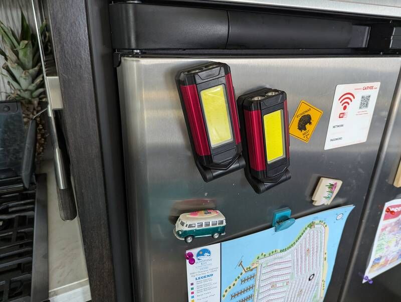

# RAM 3500 DRW

We tow our RV with a 2014 RAM 3500 SLT DRW (8' bed) with a roll-and-lock
retractable truck bed cover.

## Table of Contents

Did we miss something or do you know better alternatives? We'd love to hear from
you! File an issue or open a pull-request.

- [Vehicle Specs](#vehicle-specs)
  - [General Notes](#general-notes)
  - [Tires](#tires)
  - [Engine Coolant](#engine-coolant)
  - [Engine Oil](#engine-oil)
  - [Transmission](#transmission)
  - [CCV Filter](#ccv-filter)
- [Item Lists](#item-lists)
  - [Generic Addons](#generic-addons) for any car

## Vehicle Specs

General vehicle specs and maintenance intervals.

### General Notes

- **DISCLAIMER: Always go with your specific vehicle's instructions, this is not
  a replacement.**
- When torquing and lug or bolt, check the appropriate unit: ft/lbs, in/lbs, Nm
- For all fluids, watch out for the exact spec not the branding or "Universal",
  "American vehicles", etc. qualifications unless you're in a desperate
  situation as you'll have to flush out the whole system if you top-up with the
  wrong fluid.

### Tires

- 235/80R17 Tires: Regular load range E tires work well on the truck and are
  within spec but we use commercial G-rated tires on the trailer. If you go with
  load range G tires, be aware of the load limit on your rims too (check
  imprint!)
- Front 80psi, rear 65psi
- Wheel lug nuts: 140ft/lbs. Always start lugs by hand to avoid cross-threading
  them and tighten in star-pattern (with 8 bolts it's easiest to always skip 2
  bolts.)

### Engine Coolant

- MS-12106 only

### Engine Oil

Change every 6,000 mi when towing, 10,000 mi otherwise.

- 15W40, exactly 12 Qts (3Ga)

### Transmission

Change filter every 60,000 mi. Change oil more frequently.

- Mopar ASRC or Mobile 3309, around 10.5 Qts
- Torque oil pan bolts to 7Nm
- Torque oil filter bolts to 10Nm
- Short 10mm socket. Use a 3/8" ID vinyl hose as extension to start the rear oil
  pan bolts. Start with those! This avoids having to remove the cross-member to
  access them. Alternatively you can use a (short) 11mm socket to start them but
  beware potential cross-threading issues.

### CCV Filter

Change the crankshaft ventilation filter every 20,000 mi. Deletes are not worth
it.

## Item Lists

The information is free to use whether you use our links or not but if you
choose to, we'd like to sincerely thank you for supporting this work.

_As an Amazon Associate I earn from qualifying purchases._

- [RV Towing Related Equipment](#rv-towing-related-equipment)
- [Tools](#tools)
- [Maintenance](#maintenance)
- [Cosmetic](#cosmetic)
- [Tuning](#tuning)
- [Generic Addons](#generic-addons)

### RV Towing Related Equipment

- [2" Hitch Adapter Reducer Sleeve](https://www.amazon.com/Curt-Manufacturing-45405-Reducer-Sleeve/dp/B001EOWQRQ?tag=rvlifehacks-20)
  Reduces the 2.5" Hitch adapter to a regular 2" so you can use the cheaper
  ball-hitch for the dump tote or lighter trailers.
- [Lockable Hitch Pin](https://www.amazon.com/CZC-AUTO-Receiver-Stainless-Trailer/dp/B081644R21?tag=rvlifehacks-20)
- [Pickup cargo net](https://www.amazon.com/TireTek-Accessories-Heavy-Duty-Stretches-Carabiners/dp/B07ZQP5QG7?tag=rvlifehacks-20)
  You'll want it after loosing random stuff on the freeway. Works well with the
  Andersen hitch in the middle.

### Tools

We're not listing all general tools like screwdrivers, nuts, pliers etc.

- [Wire brushes for 1/4" impact](https://www.amazon.com/Carbon-Rocaris-Removal-Corrosion-Surfaces/dp/B0BLGKLLCG?tag=rvlifehacks-20)

### Maintenance

- [Diesel Supplement](https://www.amazon.com/Stanadyne-Diesel-Performance-Formula-38566/dp/B000M5QPSY?tag=rvlifehacks-20)
  Cetane Booster. Keeps the engine and injectors clean. We use it on every tank
  fill.
- [Digital Tire Pressure Gauge](https://www.amazon.com/dp/B0BY2GD9VC?tag=rvlifehacks-20)
  Very precise and consistent. Much better than the mechanical Walmart ones.
  Goes up to enough pressure (90psi works fine)
- [On-the-go Compressor](https://www.amazon.com/AstroAI-Heavy-Duty-Compressor-Portable-1-97CFM/dp/B0CJFCRKBD?tag=rvlifehacks-20)
  Best little compressor I ever had. Been using it for over a year almost daily.
  Works great for the 90psi on the trailer. With the crocodile clamps it can
  draw more power than with the cigarette adapter but you will need to pop the
  hood or use the trailer batteries. I have the manual gauge but I linked the
  digital one because it has the auto-shut-off which I wish I'd have. While the
  cable and hose are very long, I use a jumper cable set as extension to reach
  the third wheel on the trailer.
- [Quick-Connect Valve Adapters](https://www.amazon.com/Locking-Inflator-Adapter-Connection-Compressor/dp/B0C15BSDF7?tag=rvlifehacks-20)
  Push-on instead of screwing on.
- [OEM Mopar Oil Filter](https://www.amazon.com/Mopar-05083285AA-Engine-Oil-Filter/dp/B0046NNNGK?tag=rvlifehacks-20)
  We always get the OEM one since it's good value.
- [3Ga Engine Oil 15W40](https://www.amazon.com/Rotella-550050467-3PK-Synthetic-15W-40-1-Gallon/dp/B07PSVLF6G?tag=rvlifehacks-20)
  Exactly what you need for one oil change. Works well for towing across the US
  temperature zones. Get something more viscous if you plan on staying longer in
  very cold areas. For just the occasional cold start, the 15W40 still works
  great.
- [Funnel](https://www.amazon.com/Hopkins-10704-FloTool-Spill-Measu-Funnel/dp/B0799NJSTP?tag=rvlifehacks-20)
  The closing-function is perfect for dosing. Sits well in the transmission
  fluid dipstick tube.
- [Fuel Filter Set](https://www.amazon.com/Separator-2013-2018-Replaces-68197867AA-68157291AA/dp/B07KS7SYG1?tag=rvlifehacks-20)
  Not the OEM but works great. Good value. Already bought this twice.
- [AISIN AS69RC Transmission Fluid](https://www.amazon.com/Mobil-55221-Automatic-Transmission-Fluid/dp/B00BLKXW9O?tag=rvlifehacks-20)
  Rarely needed. But unlike others, this one ships to Amazon counters. Although
  I would have gotten the Mopar ASRC if I had gotten my hands on it, I'm very
  happy with this one. I used 10.5 Quarts with the filter change. This has 12
  Qts.
- [AISIN AS69RC Transmission Oil Filter](https://www.amazon.com/Cireworx-C101-K-Transmission-68224232AA-6821491AA/dp/B0D51LKVST?tag=rvlifehacks-20)
  I would have used the OEM if it was available but I'm happy with this one.
  Comes with the gasket included, although mine was in good enough shape to be
  reused.
- [Aerospace Protectant](https://www.amazon.com/303-30313-CSR-Protectant-Plastic-Fiberglass/dp/B00KN0UOEE?tag=rvlifehacks-20)
  UV-Shield and conditioner for the vinyl on the Roll-and-Lock tonneau cover. I
  use it for any plastics permanently exposed to UV. Needs to be reapplied
  regularly, esp. after rain.

## Cosmetic

- [US Flag for the Hood](https://www.amazon.com/TOMALL-Distressed-Waterproof-Windshield-Decoration/dp/B08Y55YM32?tag=rvlifehacks-20)
  Because we're proud of the values that the best country in the world is
  founded on.

## Tuning

- [Monster RAM Intake Elbow](https://www.amazon.com/Banks-MONSTER-Compatible-Replacement-INTAKE-42798-PC/dp/B09ZCPKJ27?tag=rvlifehacks-20)
  I'm not interested in more performance, just didn't want the "Grid heater
  bolt" issue. Was a fun job to install and has been working great. Emissions
  certified in all 50 states.

## Generic Addons

Will fit any car

- [Laptop USB Charger](https://www.amazon.com/Charger-Cigarette-Lighter-MRGLAS-Samsung/dp/B0C53MKFMY?tag=rvlifehacks-20)
  60/65W USB-C Power-Delivery Adapter to charge any device, including laptops
  with USB-C chargers.
- [USB Extension](https://www.amazon.com/Rocoren-Charger-Charging-Multiple-Cigarette/dp/B0CMZVXSWH?tag=rvlifehacks-20)
  Ensures the parents in the front and the kids in the back row have USB. Also supports power-delivery.
- [Pickup cargo net](https://www.amazon.com/TireTek-Accessories-Heavy-Duty-Stretches-Carabiners/dp/B07ZQP5QG7?tag=rvlifehacks-20)
  Without you'll eventually lose something. We sure did. Also fits nicely between the Andersen Hitchball and the trailer.
- [Magnetic LED Pocket Work lights 2Pcs](https://www.amazon.com/Rechargeable-Magnetic-Flashlight-Kickstand-Carabiner/dp/B0BYSXSDKT?tag=rvlifehacks-20)
  Great to have. They last two hours easy but not 17h as stated. Double as charging bank for USB devices.

  