# Camper DIY Projects and Products

A collection of projects we did and a list of products we actually like and use
on our 2019 Grand Design Momentum 395m RV.

## Disclaimer

**⚠ DISCLAIMER: Projects and products are for educational purpose. Build, buy
and use at your own risk and peril. No guarantees whatsoever are made, even when
explicitly stated.**

## Honest Reviews

**All products listed here have been road-tested in good faith for more than
12,000 miles. We paid retail prices for all of them and are not sponsored in any
way to review the products.**

## Table of Contents

- [DIY Projects](#projects)
  - [Office / Bedroom](#office-bedroom)
  - [Living Room](#living-room)
  - [Roof](#roof)
  - [Deck](#deck)
  - [Kids Room / Garage](#kids-room-garage)
- [RV Product List](#rv-product-list)

Also check out the [RAM 3500 equipment](RAM3500.md) (not just RAM specific).

Did we miss something or do you know better alternatives? We'd love to hear from
you! File an issue or open a pull-request.

## DIY Projects

Hands-on RV modifications with photos, install notes, and lessons learned.

### Office / Bedroom

- [Foldable Office Desk](projects/office-desk.md)

  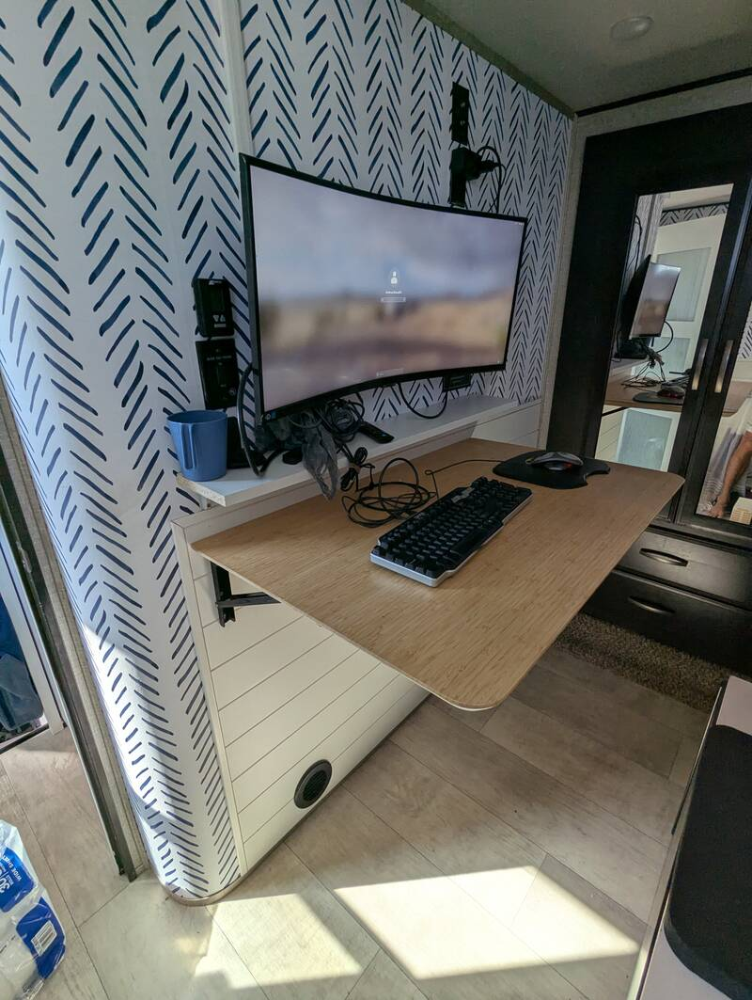

### Living Room

- [Dining Table](projects/dining-table.md)
- [Storage L-Shaped Dining Bench](projects/storage-dining-bench.md)

  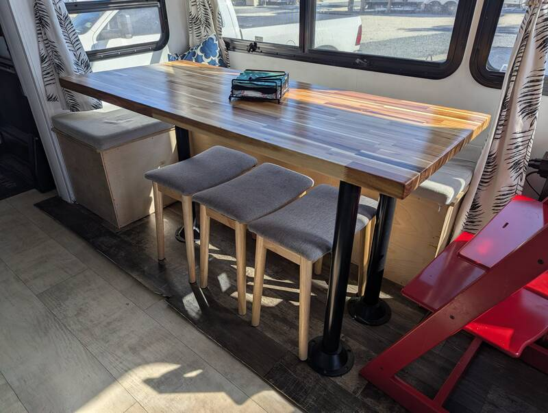

### Roof

- [Starlink roof install](projects/starlink.md)
- [Solar setup (Mechanic)](projects/solar-mechanic.md)
- [Solar setup (Electric)](projects/solar-electric.md)

  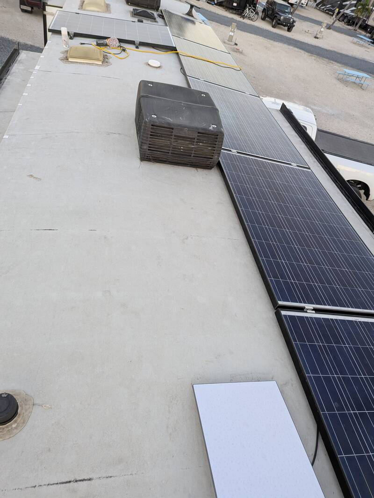

- [Roof-Mounted Dump Tote](projects/roof-mounted-dump-tote.md)

  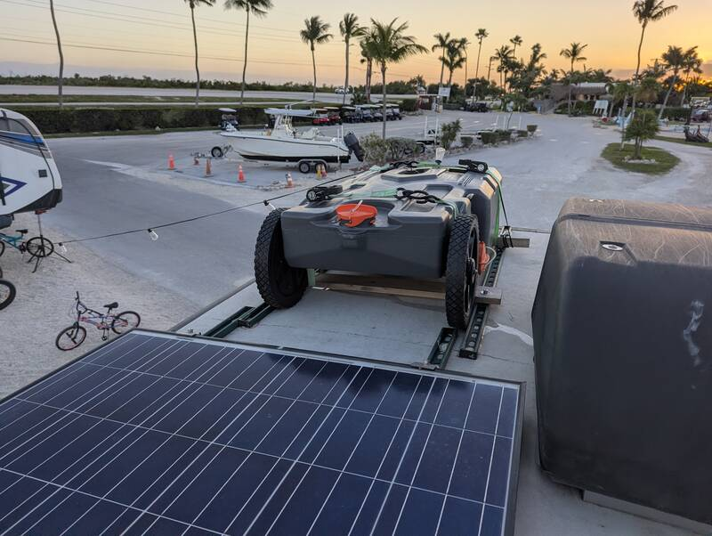

### Deck

- [Boat teak deck](projects/teak-deck.md)
- [LED lighting on deck](projects/deck-leds.md)
- [Acrylic Panel Doors](projects/acrylic-panel-doors.md)

  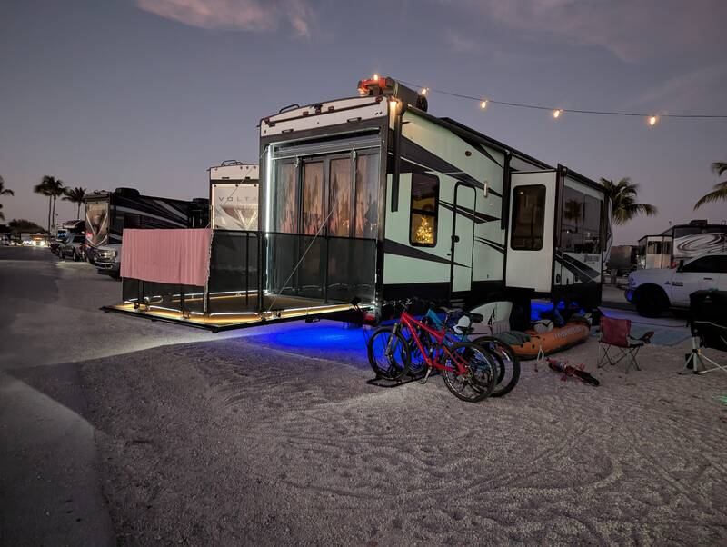

### Kids Room / Garage

- [Garage Luxury Vinyl Floor](projects/vinyl-floor.md)
- [Climbing Wall](projects/climbing-wall.md)

  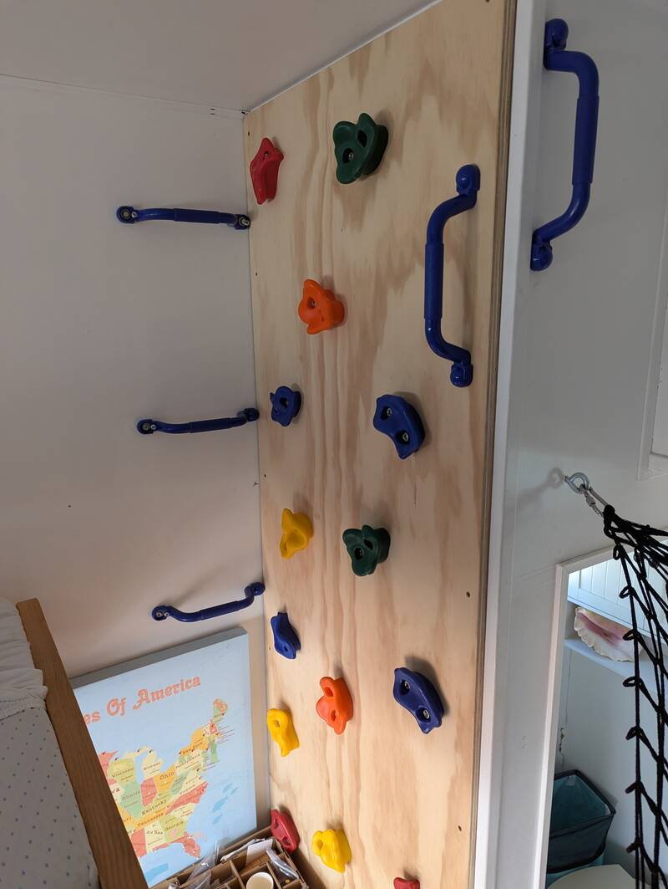

- [Loft Access from Garage](projects/garage-loft-entrance.md)

  

## RV Product List

The information is free to use whether you use our links or not but if you
choose to we would like to sincerely thank you for supporting this work.

_As an Amazon Associate I earn from qualifying purchases._

- [Couch](#couch)
- [Office](#office)
- [Dishwasher](#dishwasher)
- [Kitchen](#kitchen)
- [Bathroom](#bathroom)
- [Washer](#washer)
- [Bike Rack](#bike-rack)
- [Master Bed](#master-bed)
- [Kids Beds](#kids-beds)
- [Mouse Traps](#mouse-traps)
- [Water](#water)
- [Curtains and Shades](#curtains-and-shades)
- [Furrion Vision S Backup Cam](#furrion-vision-s-backup-cam)
- [Griddle](#griddle)
- [Generator](#generator)
- [Fridge](#fridge)
- [Plumbing and Sewage](#plumbing-and-sewage)
- [Screen Doors](#screen-doors)
- [Storage](#storage)
- [Outdoor Toys](#outdoor-toys)
- [Random Stuff](#random-stuff)

### Couch

  

    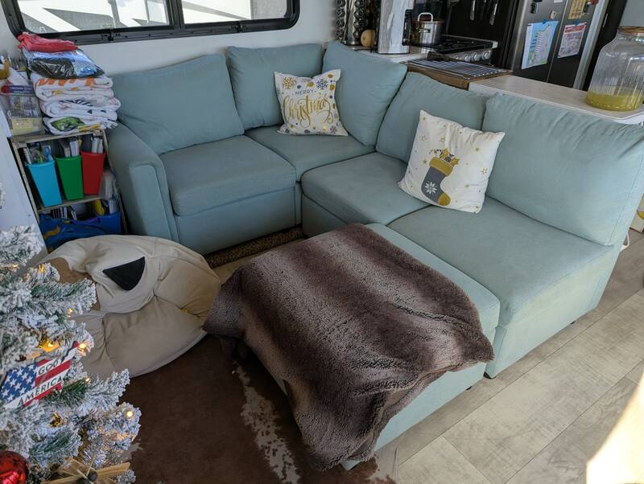
    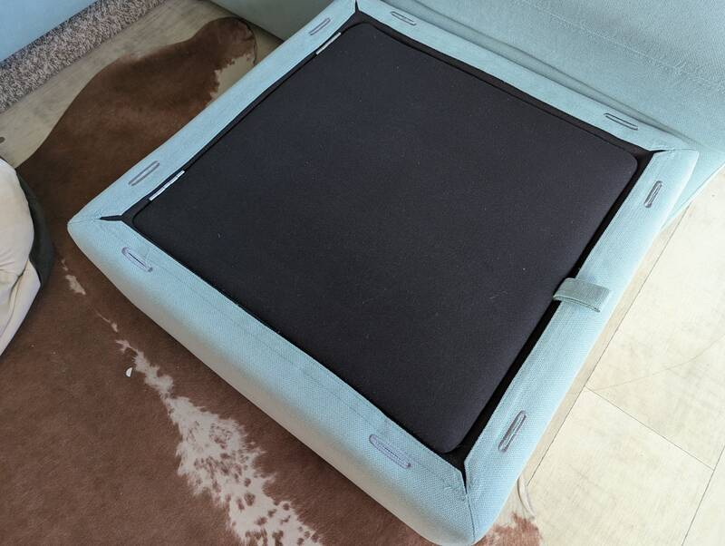
    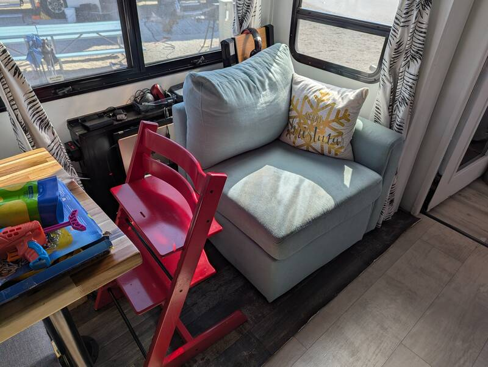
  

- Linsy Home Storage Couch. We have and love the
  [Rubik I](https://www.amazon.com/LINSY-HOME-Sectional-Sectionals-Reamovable/dp/B0DSWN15J4?tag=rvlifehacks-20)
  model but it's phased out. Ours has single-seat dimensions of 20.1"D x 25.6"W
  x 34.4"H which has since changed in the available
  [Rubik III](https://www.amazon.com/LINSY-HOME-Sectional-Removable-Convertible/dp/B0D97CJ7TZ?tag=rvlifehacks-20)
  so check your measurements.
- 2 Pack 2.5" square corner utility hinges from Walmart (two hinges per seat,
  comes with screws)

### Office

- [Fire TV Stick](https://www.amazon.com/all-new-amazon-fire-tv-stick-4k-max/dp/B0BP9SNVH9?tag=rvlifehacks-20)
  Turn any screen into a Smart TV. Too many ads but works nicely with the
  bluetooth speaker and screen.
- [Switchable Power Outlet](https://www.amazon.com/3Pack-POWAWINI-Grounded-Electrical-Indicator/dp/B0DS6HZNDB?tag=rvlifehacks-20)
  We like to turn off some appliances like the FireTV but want the plug to stay
  in.
- [HDMI Switcher](https://www.amazon.com/Aluminum-Bidirectional-Switcher-Compatible-FireStick/dp/B0BKL2HM4H?tag=rvlifehacks-20)
  Switch between computer and Fire TV without unplugging HDMI. Only needed if
  your screen has only one HDMI input. I would've preferred my computer attached
  over DisplayPort but it's hard to find 15ft DisplayPort cables at a decent
  price, so I went with HDMI.
- [Bluetooth Speaker](https://www.amazon.com/Creative-Stage-Portable-Bluetooth-Speaker/dp/B0CHKTDXWP?tag=rvlifehacks-20)
  Has a battery, aux input and also works over just USB-C to the computer.
- [15ft USB-C Cable](https://www.amazon.com/XAOSUN-Chager-MacBook-Charging-Samsung/dp/B0CHVWBGWL?tag=rvlifehacks-20)
  Brings USB from the PC to the screen. Keyboard, mouse, USB drives etc. then
  all plug into the screen's USB hub.

### Dishwasher

Works fine on 13 amp connection, technically needs 16 amps as per manual.

- [Dishwasher](https://www.amazon.com/FOTILE-Dishwasher-Combination-Energy-saving-SD2F-P3/dp/B0BZGXYQ4S?tag=rvlifehacks-20)
- Plumbing supplies (ABS pipes, elbows and primer) from Home Depot

### Kitchen

- [Magnetic Knife Holder](https://www.amazon.com/dp/B09QQQM6GW?tag=rvlifehacks-20)
  Works great. Never lost a knife in transit either.
- [Hanging Basket](https://www.amazon.com/dp/B0DKF9MDFZ?tag=rvlifehacks-20)
  Great for storing fruit. Hangs on the side of a cabinet.
- [Napkin holder](https://www.amazon.com/dp/B0DYJGXTCM?tag=rvlifehacks-20) Has a
  little weight on top that keep the napkins from flying away.
- [Revolving Spice Rack](https://www.amazon.com/Revolving-Kitchen-Organizer-Countertop-Carousel/dp/B09BQYJ66H?tag=rvlifehacks-20)
  We velcro'ed it to the counter and cover it with a Walmart bag for transport.
- [Trash bin](https://www.amazon.com/StoneSpace-Compost-Kitchen%EF%BC%8CUnder-Kitchen-Can%EF%BC%8CSmall/dp/B0B88BDD9X?tag=rvlifehacks-20)
  Mounts on the door and recycles Walmart Plastic Bags.
- [Trash bags](https://www.amazon.com/T-FORING-Gallon-Trash-Bags-Drawstring/dp/B0CZ3JZLDJ?tag=rvlifehacks-20)
  If you're ever out of Walmart Plastic Bags (like in Colorado)

### Bathroom

- [Shower](https://www.amazon.com/MENATT-Stainless-Adjustable-Rainfall-Handheld/dp/B0CRDGC83N?tag=rvlifehacks-20)
  Very happy with this one. Needs some clear silicone around the edges but if
  you're not doing other silicone jobs, just get a little tube instead of the
  gun.
- [Cabinet Fences](https://www.amazon.com/Adjustable-Stainless-Bathroom-Organization-Accessories/dp/B0C2Z532X9?tag=rvlifehacks-20)
  We use those in the bathroom cabinet, not the shower.
- [Shower Corners](https://www.amazon.com/Sakugi-Corner-Shower-Caddy-Space-Saving/dp/B0CMJ8H7ZD?tag=rvlifehacks-20)
  We use those for the shower corners.
- [Toothbrush Holder](https://www.amazon.com/Oasiteege-Toothbrush-Toothpaste-Organizer-Accessories/dp/B0CTG5JW7G?tag=rvlifehacks-20)
  We use two of those for the kids' toothbrushes and toothpaste.
- [Toothbrush Holder](https://www.amazon.com/Toothbrush-Bathrooms-Countertop-Toothbrushes-Toothpaste/dp/B0BJKGSJ85?tag=rvlifehacks-20)
  We use this one in the master bathroom where it stays in the cabinet.
- [Vent Fan Motor](https://www.amazon.com/dp/B0DPXHTH54?tag=rvlifehacks-20)
  Drop-in 12V replacement for the original.
- [Vent Cover](https://www.amazon.com/dp/B01HCNJDPK?tag=rvlifehacks-20)

  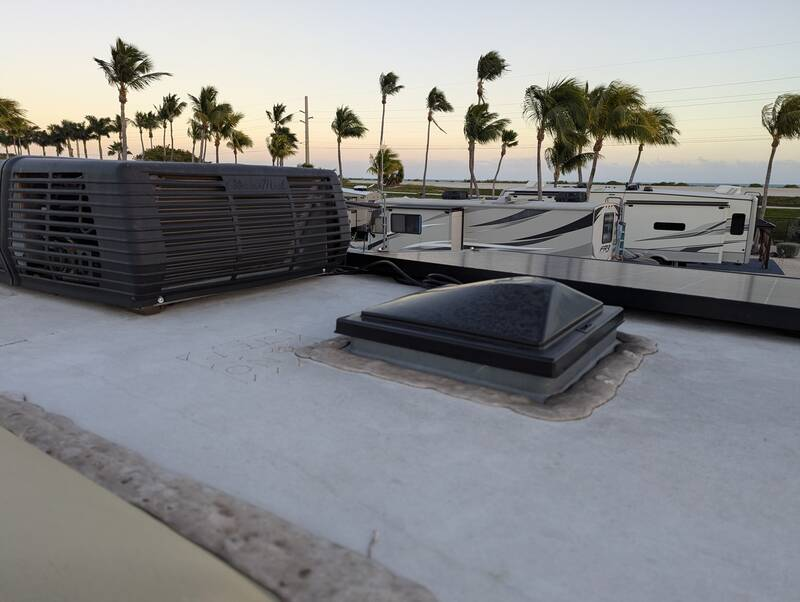

- [Laundry Basket](https://www.amazon.com/dp/B0DG1VNT9M?tag=rvlifehacks-20)
  Works fine in the kids bathroom. Pictured below.
- [Toilet (white)](https://www.amazon.com/Aqua-Magic-Residence-toilet-Profile-White/dp/B00DPIVZGC?tag=rvlifehacks-20)
  Pictured below.
- [Slim toilet brush](https://www.amazon.com/MR-SIGA-Toilet-Mounted-Compact-Bathroom/dp/B0DMNF2R32?tag=rvlifehacks-20)
  Space-efficient and works great, I'm only worried that a kid might
  accidentally drop it (retrievable).
- [Toilet Paper Holder](https://www.amazon.com/Day-MoonTM-Matte-Toilet-Holder/dp/B0CRK3L768?tag=rvlifehacks-20)
  Pictured below.
- [Hanging Cabinet]() Hang it on the studs

  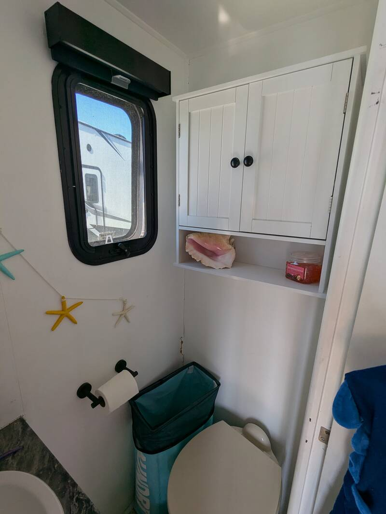

- [Trash bin](https://www.amazon.com/LYNLOO-1-9-Gallon-Installation-Triple-Seal-Technology/dp/B0D9W8YCYL?tag=rvlifehacks-20)

### Washer

- [Washer](https://www.amazon.com/Splendide-WDV2200XCD-Combo-Washer-Vented/dp/B004RCYNVO?tag=rvlifehacks-20)
  Washes well and is great on water use. Comparing with others, it seems this
  one uses only about half.
- [Dicor Non-sag Lap Sealant](https://www.amazon.com/Dicor-651SANSW-1-Non-Leveling-Ultra-Sealant/dp/B0949J5PQZ?tag=rvlifehacks-20)
  Use non-sag sealant on the screw holes and the vent cover if you drill the
  hole yourself.

### Bike Rack

Works well for 4-6 bikes (2 wedged in between). Also fits all bikes in the RAM
3500 long bed.

- [4-bike rack](https://www.amazon.com/Bike-Rack-Safeguard-Derailleurs-Waterproof/dp/B0F4X41X8C?tag=rvlifehacks-20)

### Master Bed

- [30" gas struts 150lbs](https://www.amazon.com/Springs-Support-Storage-Toolbox-IAQWE/dp/B0CQSM7WV7?tag=rvlifehacks-20)
  Get less than 150lbs for lighter mattress and/or without latex topper
- [Latex topper](https://www.amazon.com/Latex-Mattress-Topper-GOLS-Organic/dp/B09Z7SJGTD?tag=rvlifehacks-20)
  Works well but leaves a permanent print with 150lbs person. That shouldn't be

#### Kids Beds

- [Mattress](https://www.amazon.com/Greaton-4-Inch-High-Density-Replacement-Application/dp/B0BXYFHCNY?tag=rvlifehacks-20)
- [Mattress Mold Protector](https://www.amazon.com/Mattress-Breathable-Meshfiber-Ventilation-Aire-Flow/dp/B0DJS3HHQ3?tag=rvlifehacks-20)
- [Locking Carabiner Hooks](https://www.amazon.com/KINLINK-Carabiner-Stainless-Caribeener-Caribiniers/dp/B0C7VYQ2S8?tag=rvlifehacks-20)
  15 Pack. I also keep one on my key chain.
- [Climbing net](https://www.amazon.com/Bunifa-Climbing-Playground-Stairway-Polyester/dp/B0CJJJ321V?tag=rvlifehacks-20)

  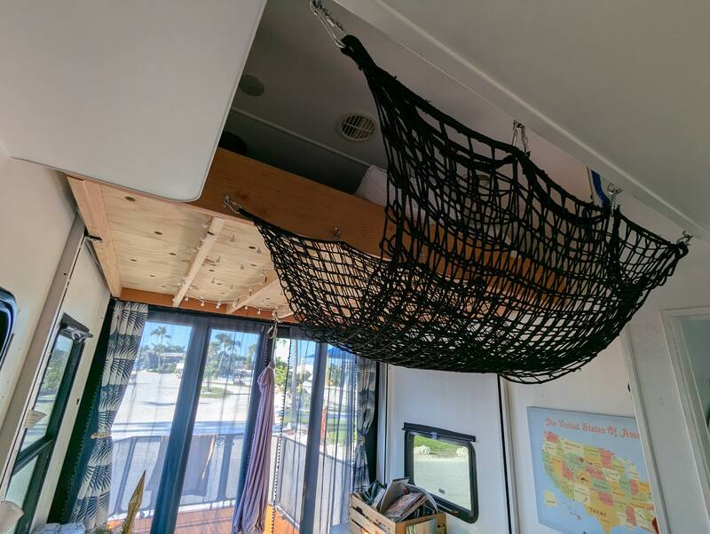

### Mouse Traps

- [Zapper traps](https://www.amazon.com/OWLTRA-OW-2-Electric-Instant-Trigger/dp/B099X9F9CD?tag=rvlifehacks-20)

### Water

- [Quick connects](https://www.amazon.com/Eden-95210-Premium-Fitting-Connect/dp/B08H4DJ7VF?tag=rvlifehacks-20)
  Block water flow when unplugged with water turned on.

### Curtains and Shades

- [Curtain Rods](https://www.amazon.com/Byondeth-Curtain-Adjustable-Diameter-Aluminium/dp/B0B7WQVYGF?tag=rvlifehacks-20)
  Apply Locktite to the screws retaining the rods since they tend to vibrate
  loose.
- [Magnetic Curtain binders](https://www.amazon.com/KLOGTSIND-Magnetic-Tiebacks-Wood-Farmhouse/dp/B0CHRTZKB6?tag=rvlifehacks-20)
- [Actual curtains (cloth)](https://www.amazon.com/HPD-Half-Price-Drapes-PRCT-D214A-84/dp/B09MMBRLD3?tag=rvlifehacks-20)
- [Shades](https://www.amazon.com/Persilux-Cordless-Free-Stop-Insulated-Protection/dp/B0DJGF6LL3?tag=rvlifehacks-20)

### Furrion Vision S Backup Cam

- [8dBi antenna](https://www.amazon.com/Antenna-Pigtail-Wireless-Routers-Repeater/dp/B07PBFKJSN?tag=rvlifehacks-20)

  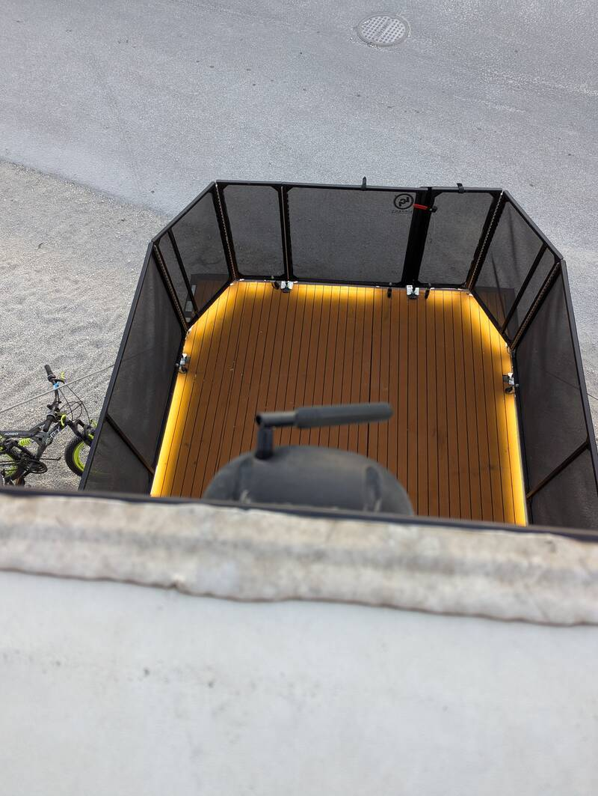

  We got this one and it works better than the stock antenna, but it would be
  better if the paddle was rotated by 90deg. I use it angled down rather than
  like a shark fin.

### Griddle

- [Blackstone 22" Griddle](https://www.amazon.com/Blackstone-1939-Griddle-Station-Kitchen/dp/B08G1R13DV?tag=rvlifehacks-20)

  Must have. Always scrape it well and it'll last long. Ours has seen daily use
  for four years now. The stand is rather cheap but it's the best-value deal.

- [Replacement Screws for Stand](https://www.amazon.com/Petrirufun-Screws-Blackstone-Stand-Replacement/dp/B0BZ3FJPTY?tag=rvlifehacks-20)
  We replaced about one per year.

  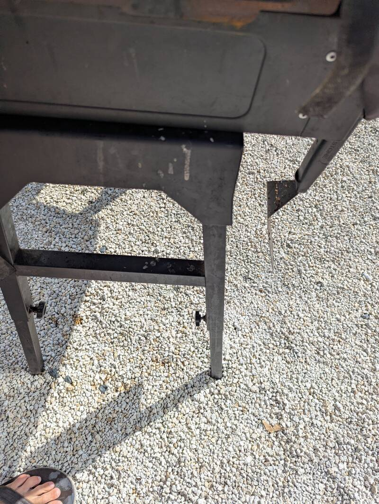

- [Wind Guards](https://www.amazon.com/Blackstone-Accessories-MeWeBlue-5018-Compatible/dp/B0BLNDX7L3?tag=rvlifehacks-20)
  An absolute must-have to use the griddle with just a little bit of wind. Also
  saves about 1/3 in LPG.

  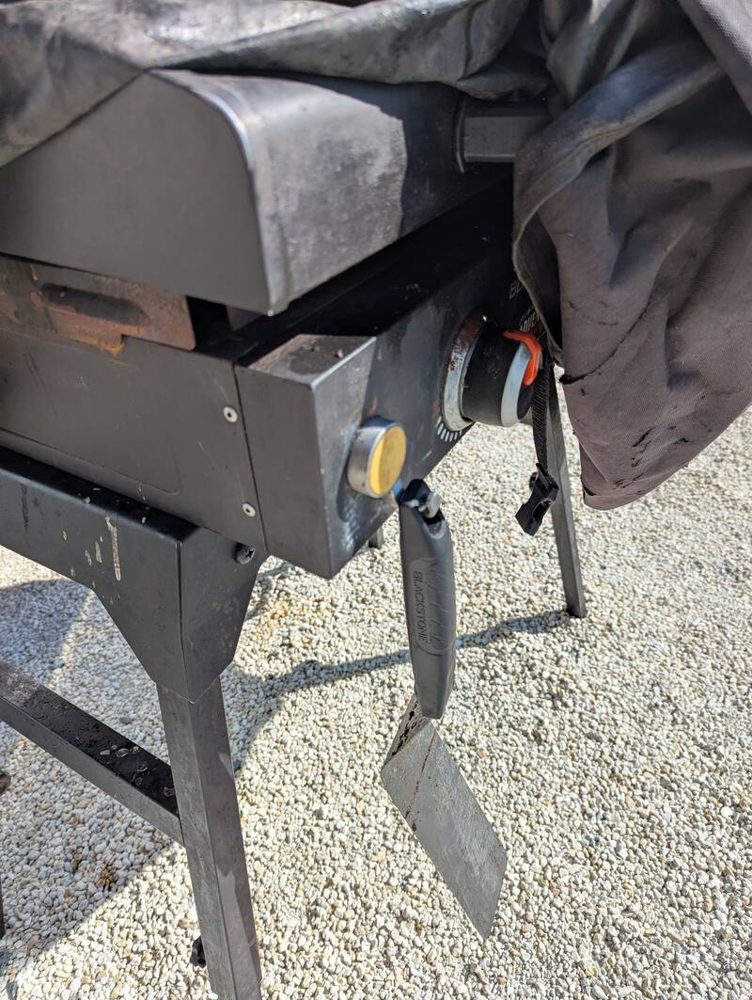

- [Self-tapping Screws](https://www.amazon.com/VGBUY-Assortment-Stainless-Drilling-Modified/dp/B0CQ7LYTXD?tag=rvlifehacks-20)

  Always useful. Put one in every wind guard, then you'll never lose them. These
  have Philips heads. Let me know if you found a good set of self-tapping screws
  with Robertson (square drive) heads.

- [Gas hose with Quick-Connect](https://www.amazon.com/GASPRO-Propane-Connect-Extension-Pressure/dp/B09XF1M1RG?tag=rvlifehacks-20)
  One through the belly of the trailer and one as extension to the griddle.

  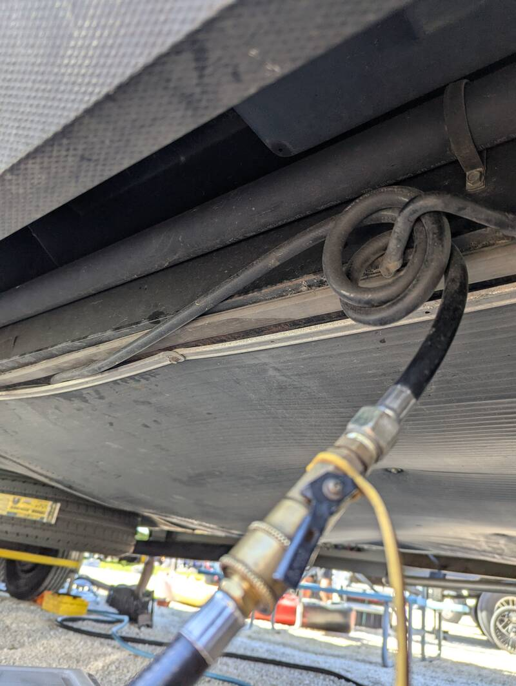

- [Gas Y Connector](https://www.amazon.com/Propane-Motorhome-Tabletop-Splitter-Disconnect/dp/B0F5ZZS18H?tag=rvlifehacks-20)
  Forks the fridge's quick connect behind the slide-out into an outdoor outlet.
  One quick-connect hose is then pulled through the underbelly to the entrance
  side (see picture above).

  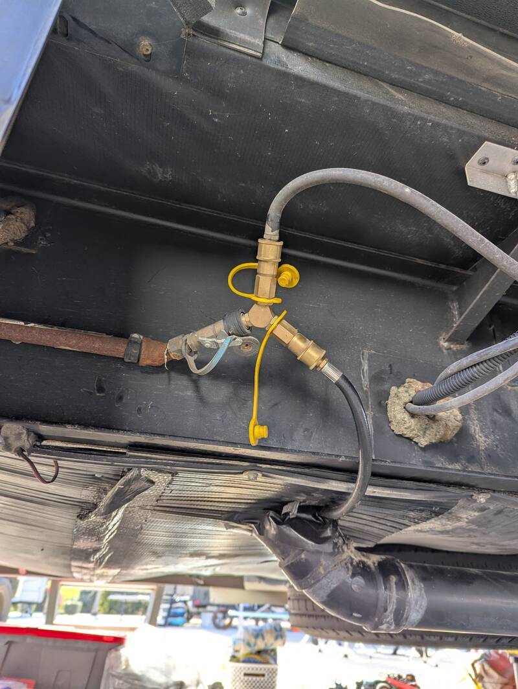

- [Scraper](https://www.amazon.com/Blackstone-Accessories-Barbecue-Stainless-Cleaning/dp/B0DP8TP4WH?tag=rvlifehacks-20)
- [Cover](https://www.amazon.com/Cover-Blackstone-22-Grill-Water-Resistant/dp/B09V72F8XQ?tag=rvlifehacks-20)
- [Burger Press](https://www.amazon.com/SHINESTAR-Blackstone-Griddle-Pre-Seasoned-Outdoor/dp/B0CL6PRSGN?tag=rvlifehacks-20)
- [Magnetic Hooks](https://www.amazon.com/Blackstone-5188-Magentic-Accessories-Stainless/dp/B09R5FT292?tag=rvlifehacks-20)

  

  The hooks are great but the scraper holder is useless since you can't close
  the lid and it just dirties too quickly. The scraper above works on those
  hooks.

### Generator

Onan 5500 Evap

- [Fuel Filter](https://www.amazon.com/dp/B004RCT19I?tag=rvlifehacks-20)
- [Oil Filter and Wrench Adapter](https://www.amazon.com/dp/B0CNCK6J53?tag=rvlifehacks-20)
- [Oil](https://www.amazon.com/dp/B000GAP43W?tag=rvlifehacks-20)

### Fridge

- [Vent for Outside](https://www.amazon.com/dp/B0C6T1LLMX?tag=rvlifehacks-20)
  Great addon, works really well, but when power cuts it needs to be put in
  manual mode by hand or it won't run.
- [RV Fridge Outside Cover Clips](https://www.amazon.com/dp/B0DP6NX5DY?tag=rvlifehacks-20)
  Quite stiff, probably not as good as the original but those weren't really
  good either.. so far those worked.

### Plumbing and Sewage

- [Valve](https://www.amazon.com/dp/B085RRTZKF?tag=rvlifehacks-20) Every time
  you fix a line that doesn't have a stop valve on the manifold, do yourself a
  favor and add one.
- [Sewer Hose Support](https://www.amazon.com/Beech-Lane-Support-Collapse-Drainage/dp/B0BQ7J77PC?tag=rvlifehacks-20)
  Note the little arch at the bottom that is useful for crossing with the power
  or water line.
- [Backflush Valve](https://www.amazon.com/Camco-Blaster-Rinser-Backflow-39086/dp/B072VSRG8T?tag=rvlifehacks-20)
  Regularly backflush your tanks to keep their volume and functionality.
- [10' Sewer Hose](https://www.amazon.com/Camco-39639-Revolution-Extension-Pre-Attached/dp/B074JFRW3L?tag=rvlifehacks-20)
  We keep three of those and a shorter one (included with the tote tank below).
- [28 Ga Tote Tank](https://www.amazon.com/Camco-Rhino-28-Gallon-Tote-Built/dp/B07K87FR5C?tag=rvlifehacks-20)
  Great for sites without sewage. Hookable to a rear ladder. We attached ours to
  the roof with spare unistruts from the solar install. 28Ga seems unavailable, 21 or 36 are.
- [Drain Valve Lubricant](https://www.amazon.com/dp/B000BGK2L0?tag=rvlifehacks-20)
  Only use on black tanks and if valve gets sticky. Don't use as preventive
  measure. This one is water-soluble and doesn't contain silicones.

### Chocks and Leveling

- [Wheel chocks (pack of two)](https://www.amazon.com/Camco-Wheel-Chock-Removal-Trailer/dp/B071KY2K37?tag=rvlifehacks-20)
  Small enough to conveniently store away, big enough to be useful on slopes or
  the truck. The ones with ropes are nice to carry, but the 7$ price difference
  is definitely not justified.
  [Standard chocks](https://www.amazon.com/Camco-Wheel-Chock-Removal-Trailer/dp/B00K1C1WC2?tag=rvlifehacks-20).

- [Ratchet Straps](https://www.amazon.com/DEWALT-DXBC50002-Yellow-Ratchet-Straps/dp/B0BYKDSZQT?tag=rvlifehacks-20)
  Hold the legs together. As described and pictured below with the jack blocks,
  it's not such a Grand Design to have levels face outwards as it causes them to
  slip when extending far. The straps help even out the slippage. **Get the
  5,000lbs heavy duty ones because the ratchet on the cheaper ones won't let you
  tighten them much before breaking.**

#### Andersen Equipment

- [Andersen Jack Blocks](https://www.amazon.com/ANDERSEN-Accessories-Stabilizers-Jackstands-Quickjack/dp/B0888SDR63?tag=rvlifehacks-20)

  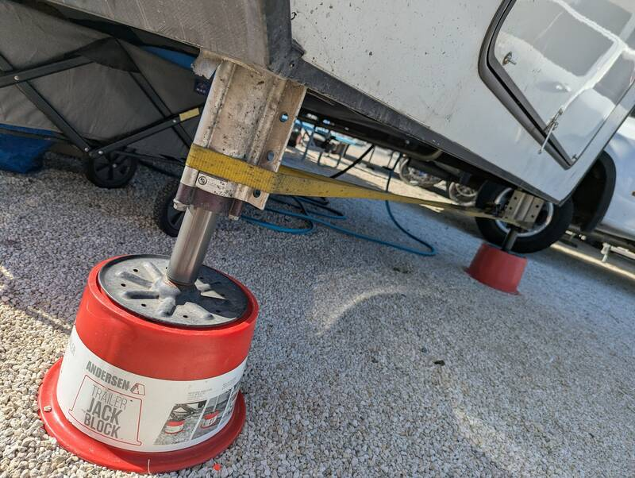

  MUST-HAVE TWO 8" ones! Our Momentum has slightly outward-facing leveling jacks
  which is the worst idea ever because since it forms a triangle, as you push up
  the rig tension applies to the I-Beams and/or the jack pads start sliding. To
  minimize the sliding, you need blocks as high as possible. Andersen are a
  solid choice because of the little side-wall that prevents sliding. The
  magnets are nice but will stop working well if your metal jack pad is bent.
  Lifetime warranty story: One of our blocks that we had gotten used with the
  camper was replaced free of charge (except shipping ~15$) by Andersen when it
  cracked. While it lost about 2" in height, it still retained the camper!
  Fantastic customer service.

- [Set of 4x 8", 2x 4"](https://www.amazon.com/ANDERSEN-Accessories-Stabilizers-Jackstands-Quickjack/dp/B0F11L567T?tag=rvlifehacks-20)
  We wouldn't recommend all big ones because there's plenty of situations where
  the trailer is too slanted to fit the 8" under the rear jacks, but the 4"
  would fit. If storage is an issue, get only two 8" ones and do the rest with
  leveling blocks. If storage is not an issue, this seems like the ideal set.

- [Andersend Fifhwheel Hitch](https://www.amazon.com/ANDERSEN-Connection-Gooseneck-Accessories-3220/dp/B09H7SMYZ5?tag=rvlifehacks-20)
  Was recommended to us by a fulltimer-friend. Absolutely happy with it because
  it allows for two additional 28Ga storage totes behind the hitch (in a long
  bed). The hitch mounts to the gooseneck ball in the truck bed. Make sure to
  chock your trailer properly when hitching and unhitching because you have to
  push the front over the hitch, so it'll be inclined much steeper than with the
  regular hitch.

- [Safety Chains](https://www.amazon.com/MEPARERI-Ultimate-Connection-Trailer-Safety/dp/B0CN6XB9QP?tag=rvlifehacks-20)
  Much better value than the
  [Andersen original](https://www.amazon.com/3249-Ultimate-Connection-Safety-Chains/dp/B0792C5XRW?tag=rvlifehacks-20)
  . The knock-off has fully satisfied us and also comes with the hooks for the
  Andersen hitch adapter. Some states may require chains when not using a
  standard fifth-wheel hitch. Even if not, they've come in handy for other
  purposes: I hook my roll-and-lock tonneau cover int it and it works on tow
  hooks for people stuck on the beach.

### Screen Doors

- [Screen Defender for 28" Door](https://www.amazon.com/Lippert-Components-859793-Defender-Protector/dp/B086HHKQVW?tag=rvlifehacks-20)
- [Screen Defender for 30" Door](https://www.amazon.com/Lippert-Components-859794-Defender-Protector/dp/B086HJRRRS?tag=rvlifehacks-20)
  One for the front and one for the back door. Great with little kids. Also
  works for dogs and cats that don't jump above the door handle.

  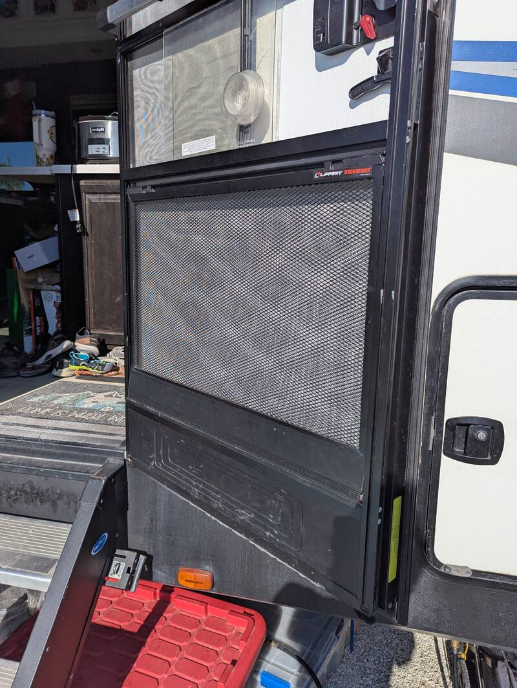

- [Screen Repair Tape](https://www.amazon.com/Grey-30-FT-Adhesive-Fiberglass/dp/B0BYZ7XBSG?tag=rvlifehacks-20)
  Not as pretty as replacing the whole screen but it works really well and
  doesn't look too bad.
- [Screen Repair Kit](https://www.amazon.com/HOMMEE-Screen-Repair-Kit-Installing/dp/B0B1B3VTMJ?tag=rvlifehacks-20)
  Great tool to push the spline back in when it gets loose.

### Storage

Under the bed storage bins. The bins are good but the clips come off a bit too
often. Better than the clip breaking off, but a tad tighter would help.

- [Small 12Qt Storage Bins](https://www.amazon.com/Amazon-Basics-Stackable-Plastic-Latching/dp/B09V5L93P3?tag=rvlifehacks-20)
- [Medium 32Qt Storage Bins](https://www.amazon.com/IRIS-USA-Plastic-Container-Latching/dp/B0BRFJ5QRK?tag=rvlifehacks-20)
- [Large 72Qt Storage Bins](https://www.amazon.com/IRIS-USA-Plastic-Container-Latching/dp/B0BRFJ5QRK?tag=rvlifehacks-20)

### Generic Maintenance and Repairs

- [Butt connectors](https://www.amazon.com/TICONN-Connectors-Waterproof-Electrical-Automotive/dp/B086Z3H4X8?tag=rvlifehacks-20)
  for smaller wires. Used it on fridge, trailer lights, 4" roof lights, ...
- [Wire brushes for 1/4" impact](https://www.amazon.com/Carbon-Rocaris-Removal-Corrosion-Surfaces/dp/B0BLGKLLCG?tag=rvlifehacks-20)
  Removed some rust from the trailer's I-Beam that I resprayed or to clean bolts
  on the car, ...
- [BA15S Bayonet LED](https://www.amazon.com/Contact-Waterproof-Outdoor-Landscape-Lighting/dp/B07DYQ528T?tag=rvlifehacks-20)
  Replacement for burnt out filament-bulb flood light. We used cold white for
  the flood light because it's brighter. Check picture which you prefer.

  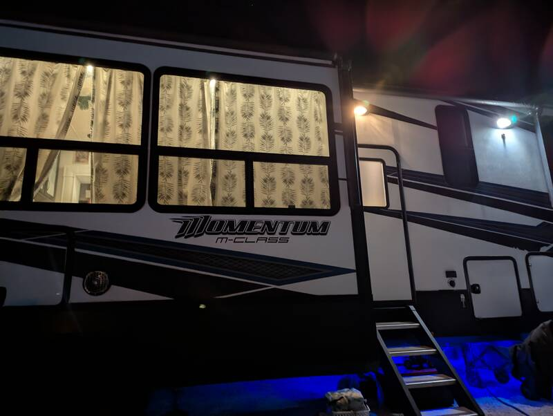

- [Ladder Safety Pins](https://www.amazon.com/Release-Diameter-Overall-Stainless-Hardware/dp/B0D2MF7SY2?tag=rvlifehacks-20)
  Great because they're actual stainless steel that doesn't rust

### Outdoor Toys

- [Inflatable Stand-Up Paddleboard](https://www.amazon.com/Roc-Inflatable-Premium-Accessories-Non-Slip/dp/B0CCDJTSXC/145-2059997-6840361?tag=rvlifehacks-20)
  Great paddleboard. Very happy with it: feels sturdy on the water, durable,
  non-slip and comes with paddles for SUP and kayak styles.
- [Inflatable Kayak](https://www.amazon.com/Hydro-Force-126-39-Rapid-Kayak/dp/B09X26R446?tag=rvlifehacks-20)
  One of the few inflatable 3-seat kayaks. Seems the best of its class but not
  satisfactory enough for us. Noticeable drag from slight deflation after an
  hour of use. Would not buy again but go with a second SUP instead or a
  hard-shell that costs twice as much.

  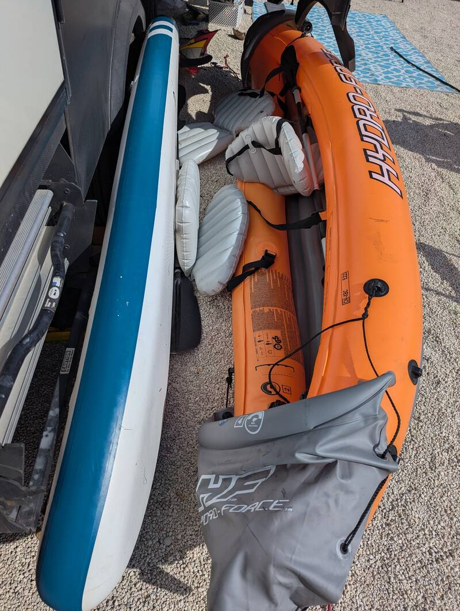

- [Auto-Shutoff Pump](https://www.amazon.com/Paddleboard-Professional-Compressor-Deflation-Inflatables/dp/B0CS6HXQPH?tag=rvlifehacks-20)
  Pump with set-point and auto-shutoff. Perfect for the SUP. Takes about
  10-15min for the SUP. Used many times, comes with different adapters that work
  for both the kayak and the SUP. Handles the 15psi SUP perfectly. Plugs into
  the car's 12V cigarette lighter socket.
- [Outdoor Cart](https://www.amazon.com/Mac-Sports-Collapsible-Outdoor-Utility/dp/B072JWBP66?tag=rvlifehacks-20)
  Perfect to store the kids helmets, the griddle cover or shoes outside but
  covered. When the front is too low, it fits under the slide-out.

  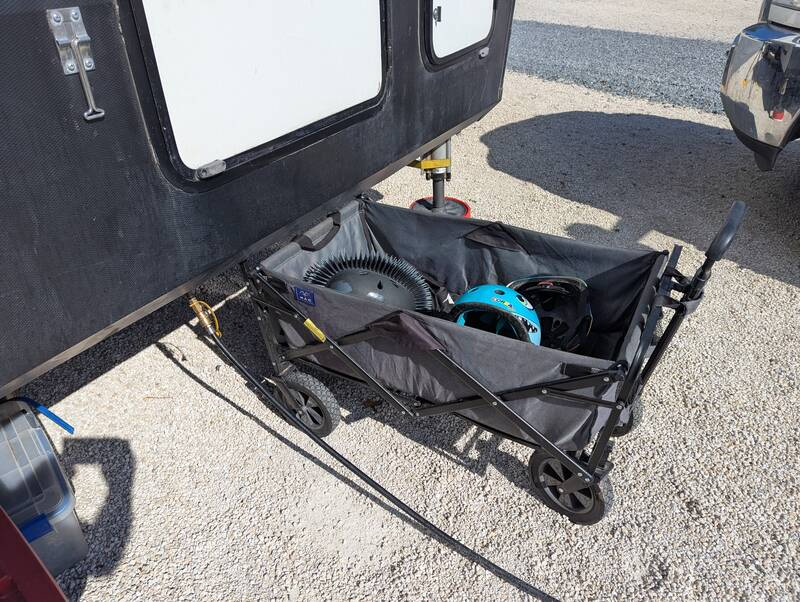
  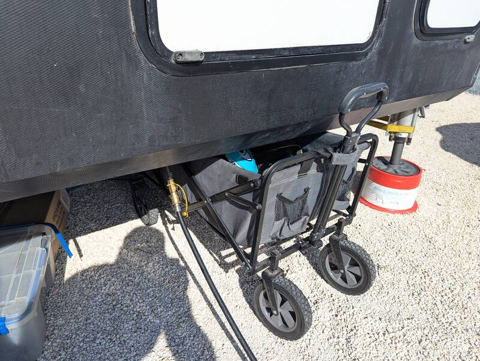

### Random Stuff

- [Tripod Stabilizer](https://www.amazon.com/Schumaho-Gooseneck-Stabilizer-Adjustable-%EF%BC%88Patented/dp/B0DRGVGBD1?tag=rvlifehacks-20)
  Works with the Andersen hitch. For a regular fifth-wheel hitch, use the

  

  [King Pin variation](https://www.amazon.com/Schumaho-Gooseneck-Stabilizer-Adjustable-%EF%BC%88Patented/dp/B0CL56P9KF?tag=rvlifehacks-20)
  Must-have item for everyone with washer/drying in their front. Nice to have
  for everyone else. Measure your height and make sure it's enough. We need some
  leveling blocks in some cases to keep it straight or extend it to the
  necessary height.

- [Rope-Ball Door stoppers](https://www.amazon.com/Creative-Co-op-DE1586-Nautical-White/dp/B00AU4D9H2?tag=rvlifehacks-20)
- [Slim dresser](https://www.amazon.com/Sorbus-Kids-Dresser-Drawers-Organizer/dp/B0DYPZV8TJ?tag=rvlifehacks-20)
- [Outdoor rug](https://www.amazon.com/HEBE-Outdoor-Waterproof-Reversible-Backyard/dp/B0CKVCWYFX?tag=rvlifehacks-20)
  Rug works fine, USB broke off after less than a handful of uses.
- [RV Propane Regulator](https://www.amazon.com/Fairview-GR-9984-Automatic-Changeover-Regulator/dp/B0CJL6M1S4?tag=rvlifehacks-20)
  Ours started leaking and this is a drop-in replacement.
- [Awning Motor Idler Cover](https://www.amazon.com/dp/B0CWZLLFC6?tag=rvlifehacks-20)
  Lost one on the road. This one replaces it. Needs both halves replaced even if
  you still have one as it doesn't have the same curving.
- [Magnetic Work Lights](https://www.amazon.com/dp/B0BYSXSDKT?tag=rvlifehacks-20)
  Doubles as bicycle light if you're willing to hold it while riding.

  

- [Eternabond Roof Repair Tape](https://www.amazon.com/EternaBond-WHITE-Mobile-Rubber-Repair/dp/B00AYPCJ9G?tag=rvlifehacks-20)
  Lifesaver for little roof tears after scraping branches. Careful, once it's on
  it stays and will not come off. We also use it to reinforce the side of the
  awning fabric against potential tears.

  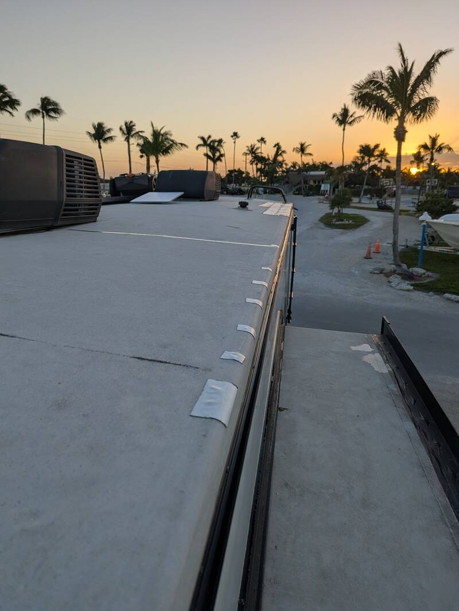

- [Spare ceiling lights 4.5"](https://www.amazon.com/Homdec-4-5Inch-Recessed-Interior-Motorhome/dp/B0899MNR36?tag=rvlifehacks-20)
  Warm white (factory)
- [Painbrushes for Epoxy](https://www.amazon.com/Bates-Brushes-Natural-Bristle-Painting/dp/B0BFFYRX23?tag=rvlifehacks-20)
- [Door Seal Brush Strip](https://www.amazon.com/Weather-Stripping-Sliding-Windows-Backing/dp/B0BVZZSQVD?tag=rvlifehacks-20)
  Seals the bottom of the sliding door
- [Wallpaper](https://www.amazon.com/HaokHome-96101-1-Wallpaper-Removable-Adhesive/dp/B09KRRBDYS?tag=rvlifehacks-20)

  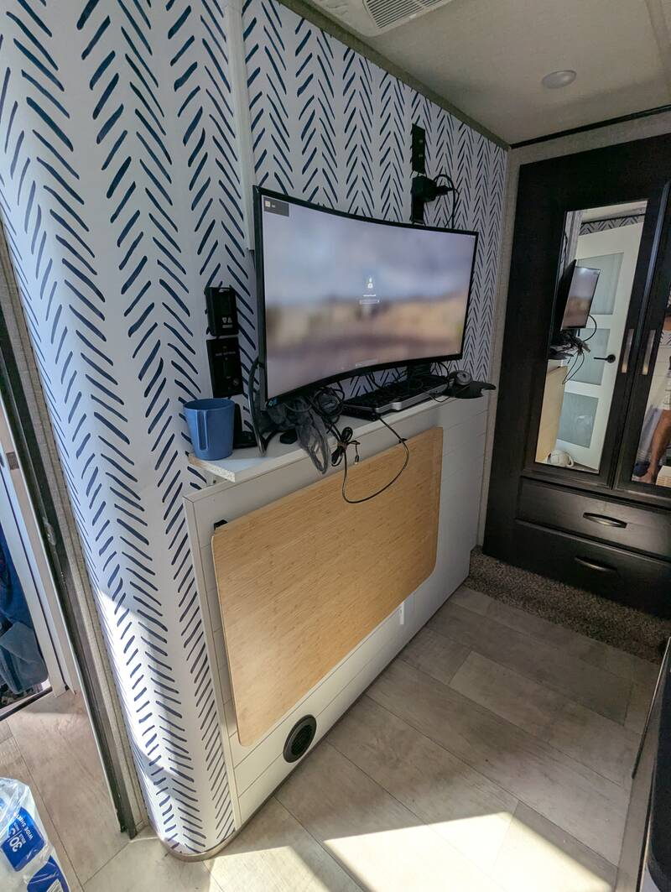

- [6" Slim Storage Shelf](https://www.amazon.com/dp/B0CX8TW9WX?tag=rvlifehacks-20)
  Next to the couch in the living room
- [Book Storage bins](https://www.amazon.com/Storex-Linking-Storage-Surface-Assorted/dp/B07SP5KK9H?tag=rvlifehacks-20)
  Fits the 6" shelf. Great for the homeschool workbook collection.
- [Magsafe Phone Holder/Charger](https://www.amazon.com/LISEN-Magsafe-Magnetic-Wireless-Charging/dp/B0CQPHLQYH?tag=rvlifehacks-20)
  We got one on the driver and one on the passenger side of the pickup. Needs a
  Magsafe case (e.g.

  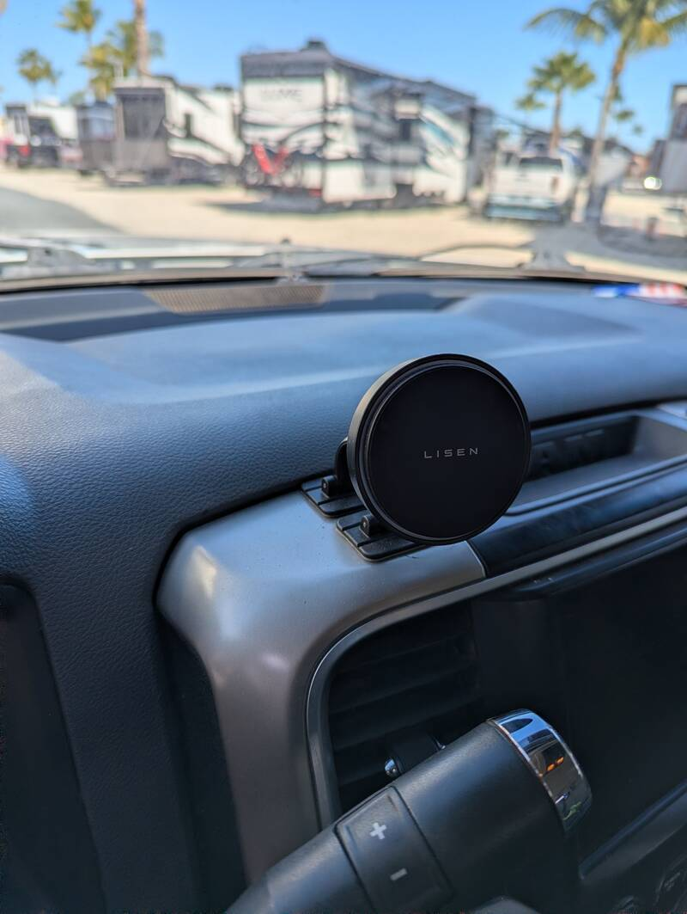

  [Case for Pixel 7](https://www.amazon.com/FNDMIL-Compatible-Anti-Fingerprint-Shockproof-Translucent/dp/B0C2C3GTDC?tag=rvlifehacks-20))
  if it's not an iPhone with magsafe.

- [Universal USB Charging Cable](https://www.amazon.com/ASICEN-Retractable-Lightning-Charging-Blackberry/dp/B074CW4QTQ?tag=rvlifehacks-20)
  Non messy cable that rolls up. Very sturdy, we had those for over two years
  around youger kids. Not for data transfer but very handy for anything not
  fast-charging. Especially if you have both Androids and iPhones. Batteries
  live longer if you don't fast-charge them all the time anyway.
- [Vacuum Extensions](https://www.amazon.com/ALL-PARTS-ETC-Accessories-Attachments/dp/B081ZG9WYR?tag=rvlifehacks-20)
  For the built-in vacuum. Ours were missing when we bought the trailer.
- [Vacuum Bags](https://www.amazon.com/InterVac-Design-Corp-Dust-Y11-5/dp/B00XNNQMI0?tag=rvlifehacks-20)
  For the built-in vacuum. Reusable a few times if you're willing to pull out
  the dirt.
