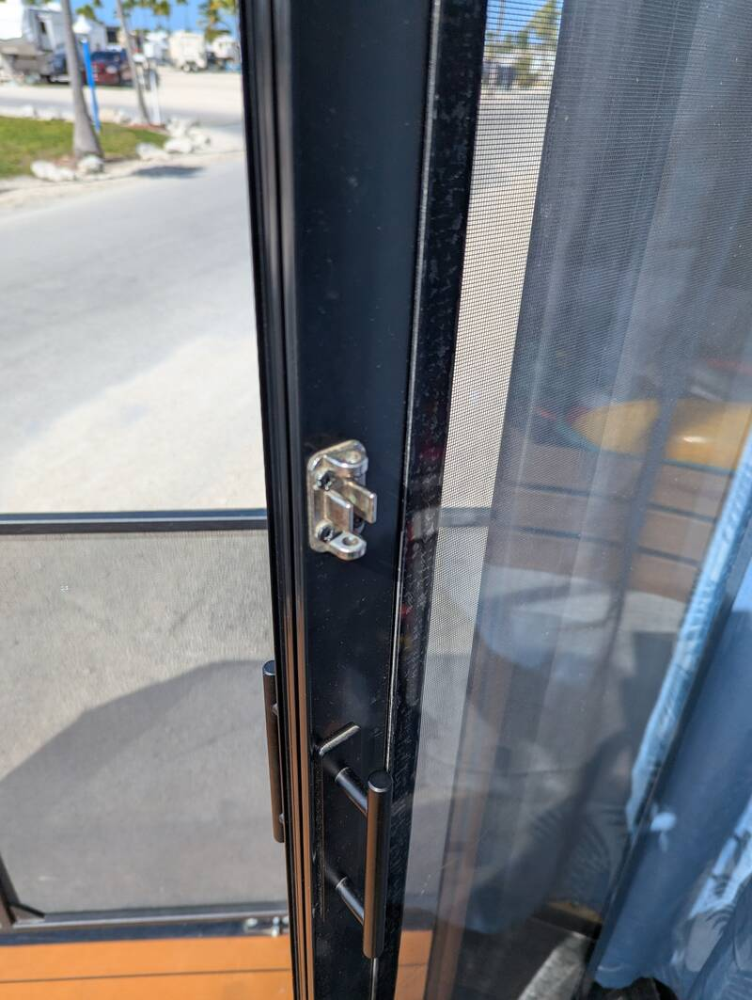
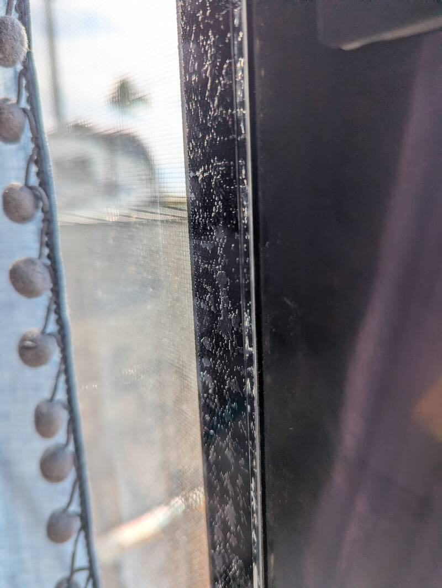

# Acrylic Deck Door Panels

- Time: 4-6 hours
- Money: $400

## Goal

Replace the ugly floppy roll-up plastic covers on the deck doors with solid
clear acrylic "plexiglass" panels.

## Photos

  
  

## Materials

- [4x8ft 1/8" Clear Acrylic Sheet](https://www.homedepot.com/p/OPTIX-48-in-x-96-in-x-0-118-1-8-in-Clear-Acrylic-Sheet-MC-100S/205351353)
  Need 2
- [Acrylic Cutter](https://www.homedepot.com/p/Utility-Knife-Plastic-Sheet-Cutting-Tool-GE-41/202038073)
- [Velcro Tape](https://www.amazon.com/Strips-Adhesive-Double-Backing-Crafting/dp/B0CGVN9SL1?tag=rvlifehacks-20)
- [Door Seal Brush Strip](https://www.amazon.com/Weather-Stripping-Sliding-Windows-Backing/dp/B0BVZZSQVD?tag=rvlifehacks-20)
  seals the bottom of the sliding door

## Notes

- Very happy with the results. We thought about 1/4" instead of 1/8" for better
  sound insulation but it's definitely not worth the price hike and the added
  weight is considerable. It's heavy enough at 1/8"
- The panel scratches rather easily so don't remove the protective plastic film
  until you apply the velcro tape (first side), or until fully mounted (second
  side.) Lay the panel on a soft non-scratch surface like a clean linen, U-Haul
  blanket or clean cardboard.
- Take width measurements on top and bottom. Two of ours weren't perfectly
  square.
- We used the acrylic cutter but it takes time to carefully score multiple deep
  lines over 8ft. If you read the Home Depot reviews on the cutting tool, some
  people said they just went with the circular saw.
- It's easier to break the long edge with two people gently pulling at the same
  time. If you don't need the full 8ft, cut off the width first to make the
  longest break shorter.
