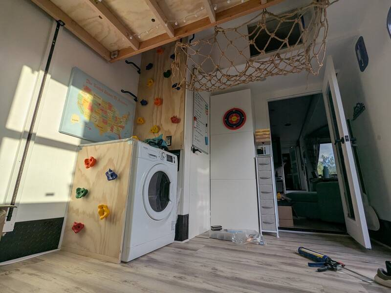

# Climbing Wall

**DISCLAIMER: BUILD AND USE AT YOUR OWN RISK AND PERIL**

- Time: 1 day
- Money: 80$

## Goal

Replace ladder with a permanent setup that's fun for kids to use and usable for
adults while still allowing the ladder as a backup.

## Photos

  
  

## Dimensions

- 2ft wide climbing wall, as high as desired (I kept it inside the trim)
- 2x2' washer-cover board

## Materials

- 3/4" Plywood Board
- [3/8-16 T-Nuts (50Pcs)](https://www.amazon.com/Wensilon-50pcs-8-16-T-nut-Four-jaw/dp/B0D6QRKBDS?tag=rvlifehacks-20)
  16$
- [3/8-16 x 1.25" Bolts (12Pcs)](https://www.amazon.com/Glvaner-Thread-Length-Stainless-Coverage/dp/B09KC1F1DB?tag=rvlifehacks-20)
  40$
- [Climbing Grips with bolts and T-Nuts](https://www.amazon.com/KINSPORY-Shape-Climbing-Outdoor-Wooden/dp/B07BJZTWGR?tag=rvlifehacks-20)
  This product seems to be similar to what we have, but **we have **not** tested
  this product.** Double-check screw length with desired board.\*\*
- [Climbing net](https://www.amazon.com/Bunifa-Climbing-Playground-Stairway-Polyester/dp/B0CJJJ321V?tag=rvlifehacks-20)
  We had another one before this one with natural fibres but it got hairy and
  started breaking under load. This one seems sturdier and doesn't shed.

### Sidewall around Washer

- 3/4" Plywood Board
- [Edge Trim](https://www.amazon.com/Trimold-Anti-Slip-Adhesive-Staircase-Protector/dp/B0C98F7JW8?tag=rvlifehacks-20)

### Safety Net

- [5/16" Eye Lag Screw](https://www.homedepot.com/p/Everbilt-5-16-in-x-4-in-Zinc-Plated-Lag-Thread-Screw-Eye-806926/204273852)

## Notes

- Measure out the washer cutout at the bottom of the wall
- Firmly attach plywood board to studs
- Sand down plywood board and edges with 80, then 240 grit
- Treat the plywood board at least for standing surfaces (over the washer)
- Use angle brackets and screws to hold the plywood boards around the washer
  together
- Install and test the washer first (rear access is hard after)
- The mesh net and the eye screws comfortably hold an adult
- Those blue U-shaped plastic handles that form a ladder are OK for small
  children (40lbs) but **will definitely not support adults**. The hole spacing
  only matched one stud on the climbing wall side, so I had to add a second
  screw into a stud on the side facing away from the climbing wall.
- One blue plastic handle did support a 155lbs adult when mounted vertically
  (next to loft entrance.) but don't make them a safety-essential element since
  I doubt there's a spec'ed weight on them.
- We haven't used the ladder since. It just lays on the floor at the side.
