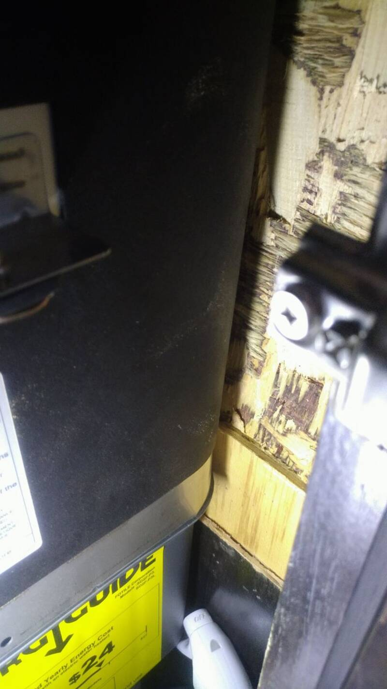
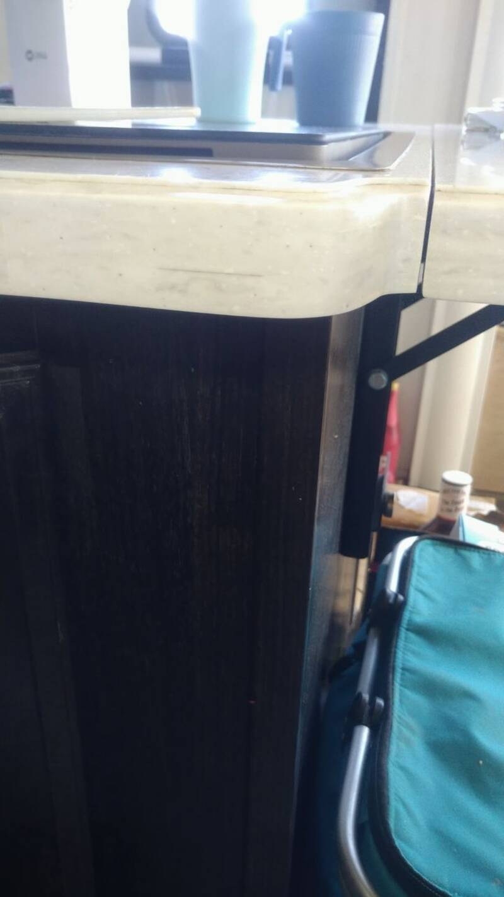
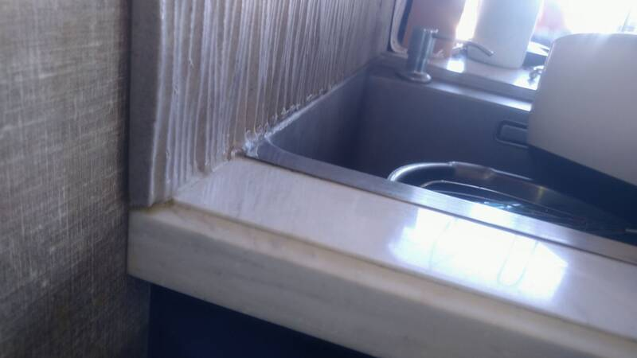
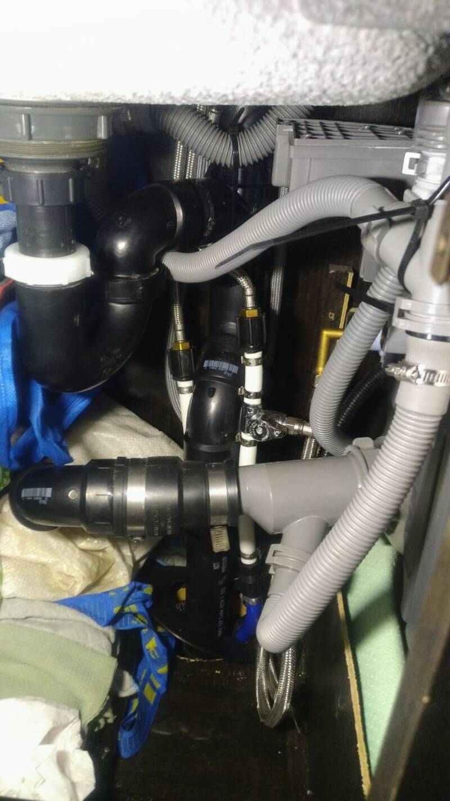
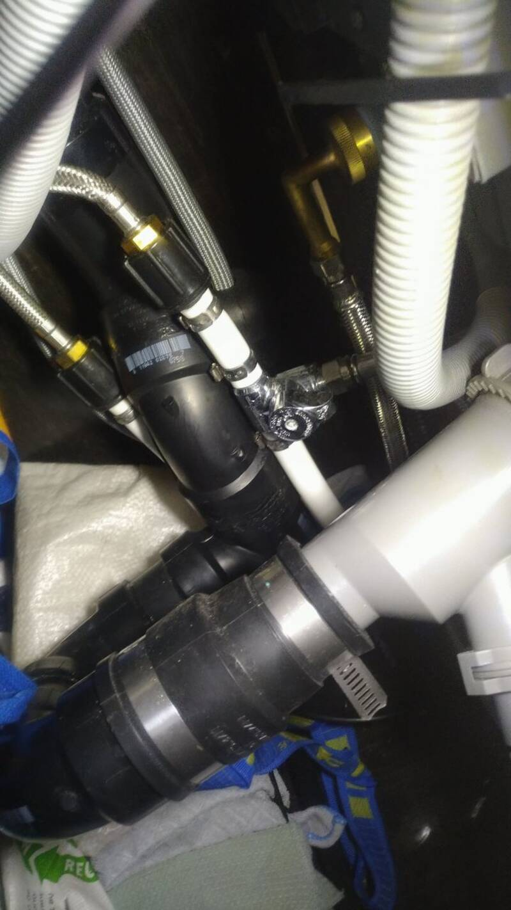
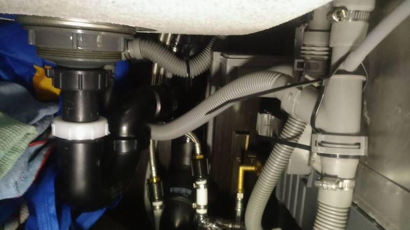
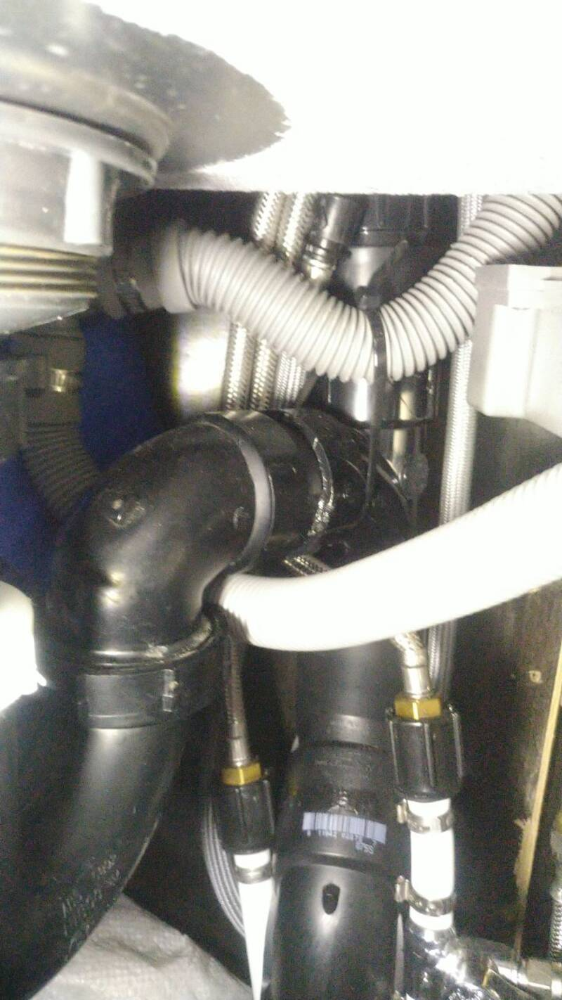

# Dishwasher

[Back to Overview](../README.md)

- Time: 1d
- Money: 1,100$ - 1,450$

## Goal

Have an RV-friendly low-water use dishwasher

## Before you Order

I cannot state this enough: **MEASURE THE AVAILABLE SPACE.** Internal
non-negotiable minimum required width at the top of the cabinet for the SD2F-P3
model is 33-1/2" (For 13-1/2" down from the top of the cabinet, then it gets a
tad wider)

Ours did not fit by about an inch and we made it fit. That hassle was definitely
worth the result. I pretty much thank God with every single load of that
dishwasher.

After countless trial-and-error trims we chiseled off about 1/2" in total from
the OSB boards on the side and 1/4" from the overhanging lip on top side of the
dishwasher.

If you do cut through the stainless steel, use the oscillating multi-tool. The
blade will be dull after but it works much better and with a nicer edge than the
angle grinder that mostly just melted through it.

## Photos

  

  
  

## Materials

- [Fotile SD2F-P5L Dishwasher with Sink](https://www.amazon.com/FOTILE-SD2F-P5L-Dishwasher-Efficient-Space-Saving/dp/B0D7M6N1PH)
  Dimensions seem to match our SD2F-P3 to within inch fractions but be sure to
  check the measurements.

  or

  [Fotile Dishwasher Only](https://www.amazon.com/FOTILE-SD2F-P5L-Dishwasher-Efficient-Space-Saving/dp/B0D7M6N1PH?tag=rvlifehacks-20)

  Since we already had a sink, that may have been the option we would've taken
  if that product had existed back then. Also would have helped in our case
  since the space between the sink and dishwasher can be optimized.

- [Dishwasher water connection](https://www.amazon.com/Eastman-Dishwasher-Installation-Compression-41037/dp/B01KAEN5UC?tag=rvlifehacks-20)
- [1/2" barb PEX Tee with 3/8" OD and Valve](https://www.amazon.com/WMAXPFIT-Valve-Compression-Shutoff-Chromed/dp/B0DB1RVLM1?tag=rvlifehacks-20)
- [No Gun Silicone](https://www.amazon.com/GE-Advanced-Silicone-Kitchen-Bathroom/dp/B0C448QB1K?tag=rvlifehacks-20)
  100% silicone. This works but it's just so much easier with the caulk gun that
  I would strongly recommend the caulk gun even if you've never used one.
- [Gun Cartridge Silicone](https://www.amazon.com/Gorilla-Silicone-Waterproof-Resistant-Cartridge/dp/B01NCSN5AS?tag=rvlifehacks-20)
  100% silicone
- Liquid Nails 10oz tube from Home Depot to glue the dishwasher to the counter
  top
- [Caulk Gun for 10oz tubes](https://www.amazon.com/WORKPRO-10OZ-Adjustable-Force-Caulking/dp/B08T9JTHNK?tag=rvlifehacks-20)
- [ABS Cement](https://www.homedepot.com/p/Oatey-4-oz-Medium-Black-ABS-Cement-309993/100136815)
- [1-1/2" ABS to 1-1/4" PVC Fitting](https://www.homedepot.com/p/Fernco-1-1-2-in-x-1-1-4-in-DWV-Flexible-PVC-Fittings-Connectors-P1056-150-125/100044154)
  spigot on the dishwasher is PVC, RV is ABS.
- [1-1/2" ABS straight pipe](https://www.homedepot.com/p/IPEX-1-1-2-in-x-24-in-ABS-DWV-Cell-core-Pipe-179694/202300518)
- [1-1/2" ABS hub-hub coupler](https://www.homedepot.com/p/Charlotte-Pipe-1-1-2-in-ABS-DWV-Hub-x-Hub-Coupling-ABS001000600HD/313834619)
- [1-1/2" ABS hub-spigot 90° elbow](https://www.homedepot.com/p/Charlotte-Pipe-1-1-2-in-ABS-DWV-90-Degree-Hub-x-Spigot-Street-Elbow-Fitting-ABS003020600HD/313834625)
- [1-1/2" ABS hub-hub 90° elbow](https://www.homedepot.com/p/Charlotte-Pipe-1-1-2-in-Acrylonitrile-Butadiene-Styrene-ABS-DWV-90-Degree-Hub-x-Hub-Elbow-Fitting-ABS003000600HD/313834629)
- [1-1/2" Drain Trap Adapter](https://www.homedepot.com/p/Charlotte-Pipe-1-1-2-in-ABS-DWV-Trap-Adapter-ABS00104P0800HD/313834571)
  For the sink downspout, if you need one.

## Notes

- MEASURE before you order
- Electric draw: Spec 1500W (13.6A at 110VAC) but measured draw is 1.2kW for
  about 5 minutes right after the fill cycle, and for another 5min for the rinse
  fill towards the end of the cycle.
- The electric supply line is wired into the outlet box right behind the
  dishwasher.
- Cycle lengths per spec: 20min, 45min or 80min but each cycle is effectively
  about 15min longer.
- Decide if you want the left or right side dishwasher. Right after it was in,
  we were wondering if I wasn't going to hit my head the whole time on the
  cabinet with the sink right under. It works fine as-is and I'd do it again but
  it was something we didn't consider ahead.
- Drain is doable without too many hacks. Get 1-1/2" ABS piping products and
  [ABS cement](https://www.homedepot.com/p/Oatey-4-oz-Medium-Black-ABS-Cement-309993/100136815)
  at Home Depot.

  

- Keep a P-trap in the sink and dishwasher's overflow lines. The manual doesn't
  account for those and it started smelling every time we parked until we
  figured out what it was. I made one by routing under/over the pipe and one by
  pulling the accordion pipe down with zip-ties. Also one connection is not
  according to manual because with the added overflow P-Trap it would've
  stretched the drain too much.

  
  

[Back to Overview](../README.md)
