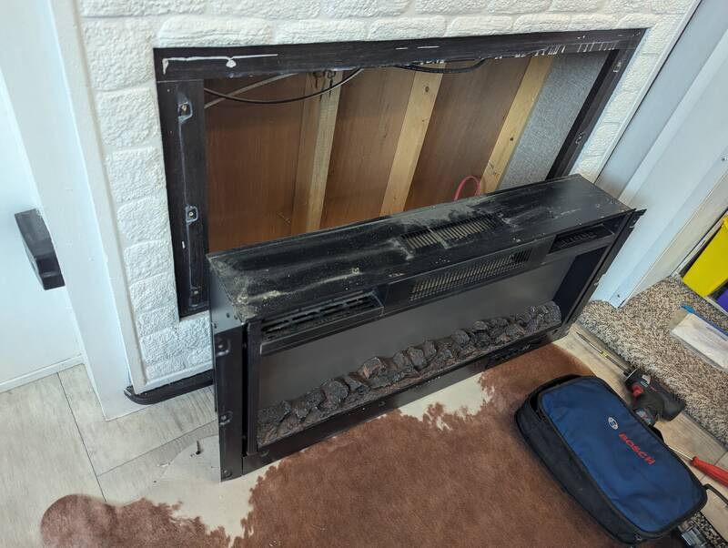
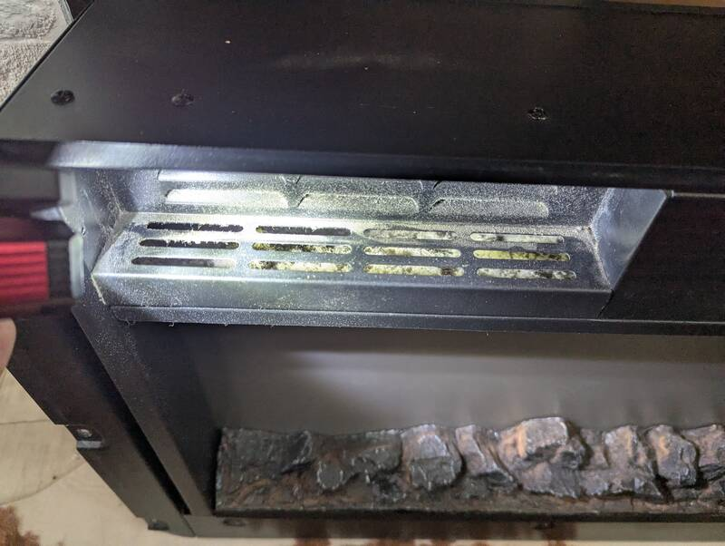
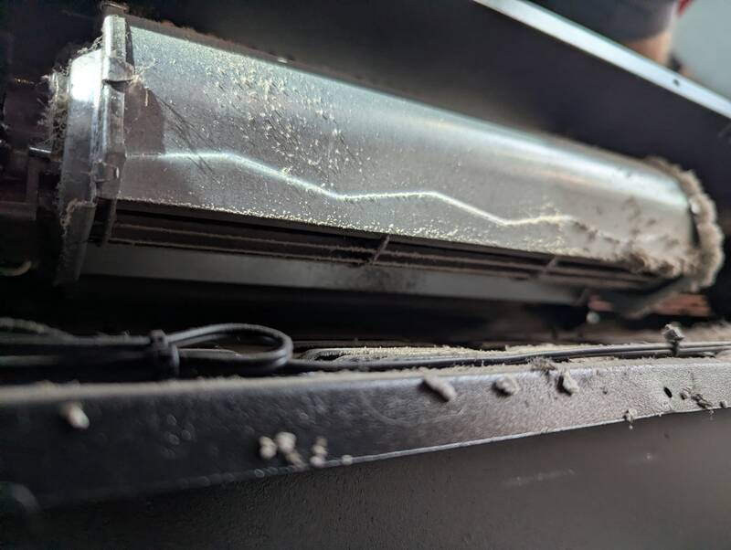
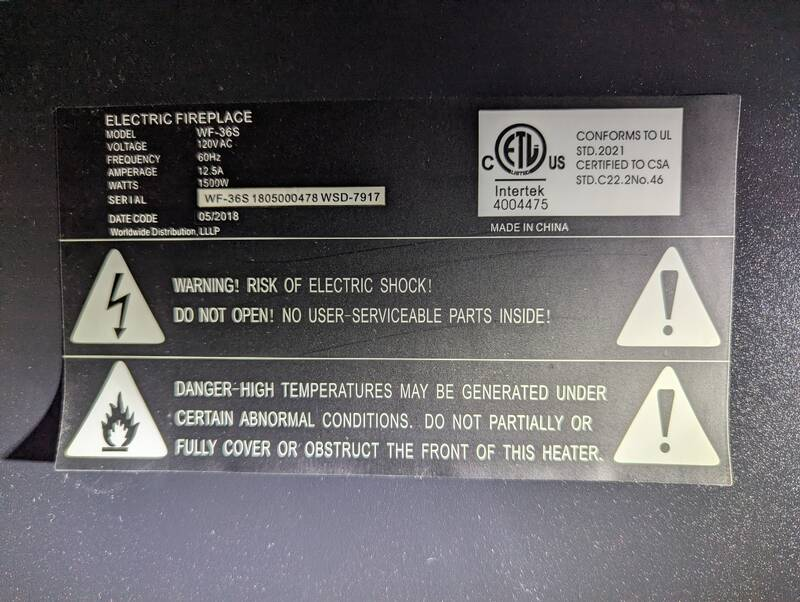
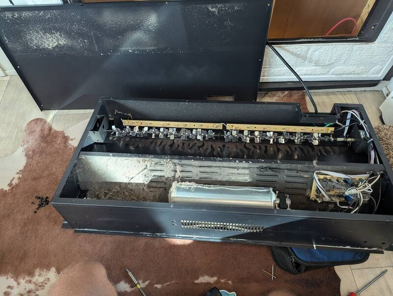
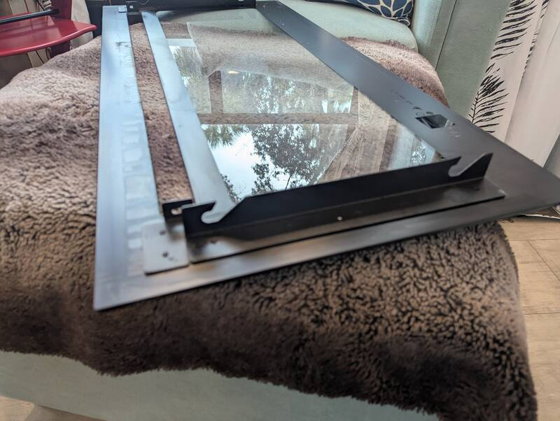
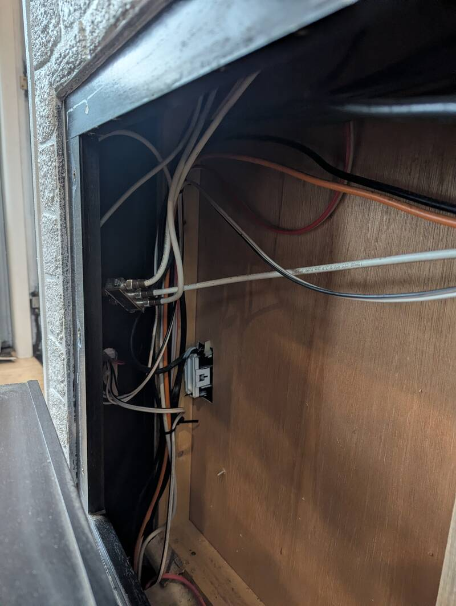
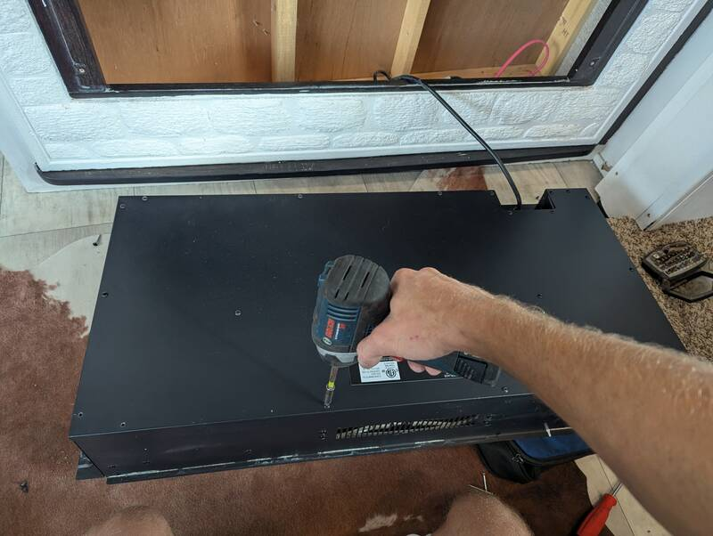
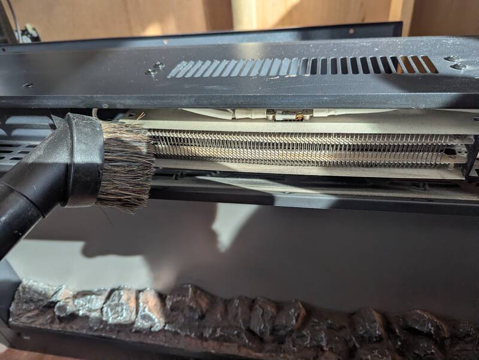
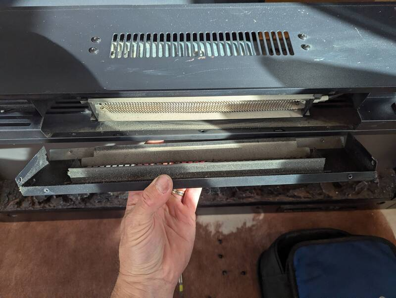

# Fireplace Cleaning

[Back to Overview](../README.md)

- Time: 1h

## Goal

Clean out the RV electric (model WF-36S) fireplace.

Cool project to show your kids how the fake flames are projected.

## Photos

  
  

  
  

  
  

  

## Notes

- The fireplace or the cavity behind have likely never been cleaned. The RV was
  about six years old at the time the pics were taken.
- Turn off the fireplace's along with the master switch if you have one, breaker
  if you don't.
- Unscrew the 2-3 screws holding the front glass panel on the inlet on both
  sides (and check if you have some in the middle, I didn't but there's holes)
- Lift the glass panel up and out. There's a top and bottom hook on each side of
  the panel and corresponding knobs on the fireplace.
  
- Remove the three screws on the left and three screws on the right to lift the
  fireplace out.
- Remove the ~20 screws on the back (two in the middle, the rest on the side)
  and pull off the back panel.
  
- Clean out the inside. I used a vacuum and brush but those can discharge
  statically so be careful on the electronics. If you want to be as careless as
  I am, don't blame me... I've done it a million times but I'm sure murphy will
  catch up with me.

  Be gentle when vacuuming the rotating mirrors as it's just sheet metal and
  don't force the motor when turning them by hand.

  

- Remove the five screws holding the panel in front of the heater grid then pull
  it out and clean.
  
- Clean the squirrel cage with the vacuum brush first, then blow it out, then
  use a damp rag/paper towel.
- Vacuum the rocks and the visible screen. Use the brush insert as to not
  scratch it.
- Clean the inside of the glass front plate with window cleaner.
- Reassemble and plug power back in if you unplugged the unit.
- Test the unit. It's normal to smell slightly burnt for the first few minutes
  from the leftover fine dust on the heater.

[Back to Overview](../README.md)
