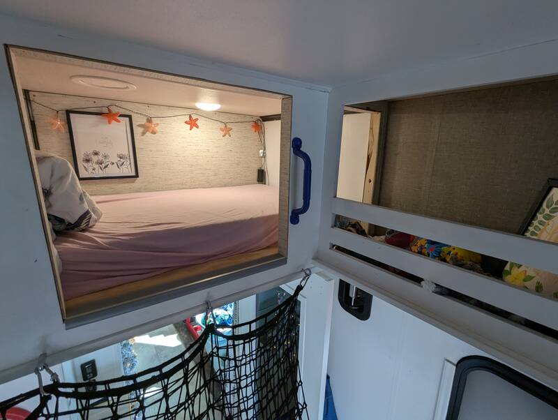
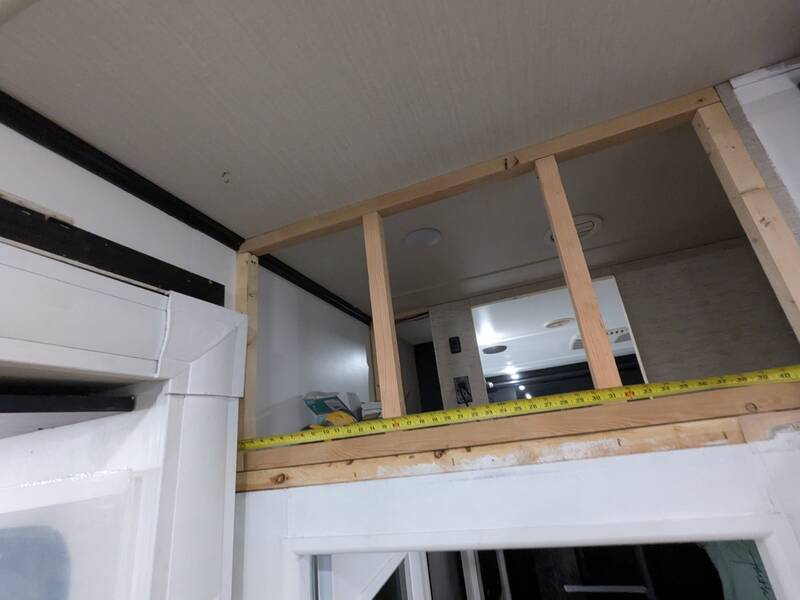
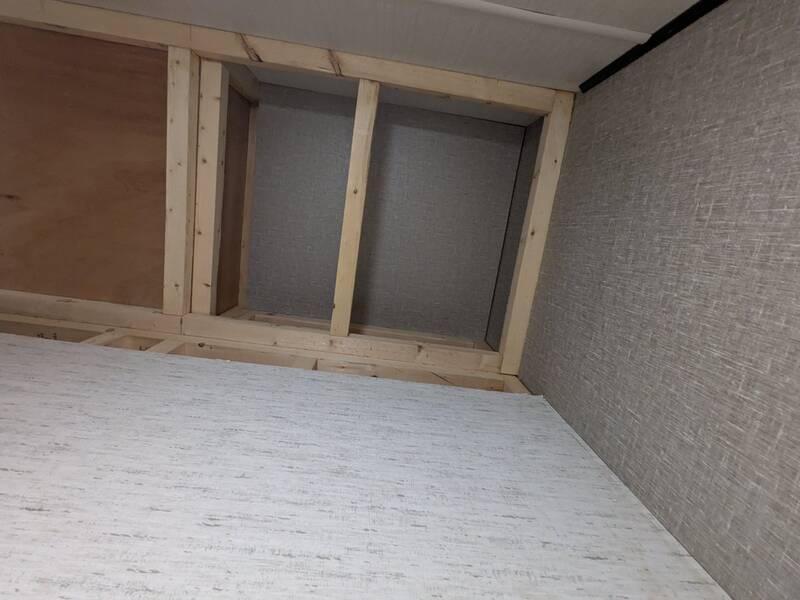
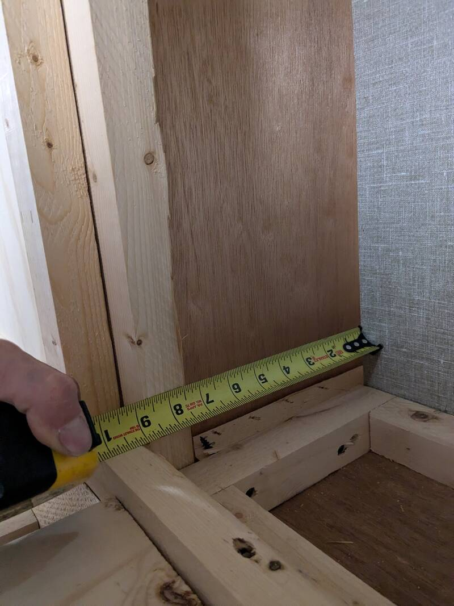

# Garage Loft Entrance

[Back to Overview](../README.md)

- Time: 2 days
- Money: 50$

## Goal

Entrance to the loft from the garage instead of from the living room so we can
close the kids room (garage) door and have a quiet living room.

## Photos

  
  

  
  

## Notes

- Created additional storage space by opening the back (over the bathroom)
- Open access to the high garage storage cabinet from the loft
- Keep the light switch and 110V outlet where it is
- Close the loft opening from the living room (add two studs and some styrofoam
  as noise-insulation)
- Close the living room access last. Working up there gets really hot once it's
  closed. Running the living room AC helps.

[Back to Overview](../README.md)
