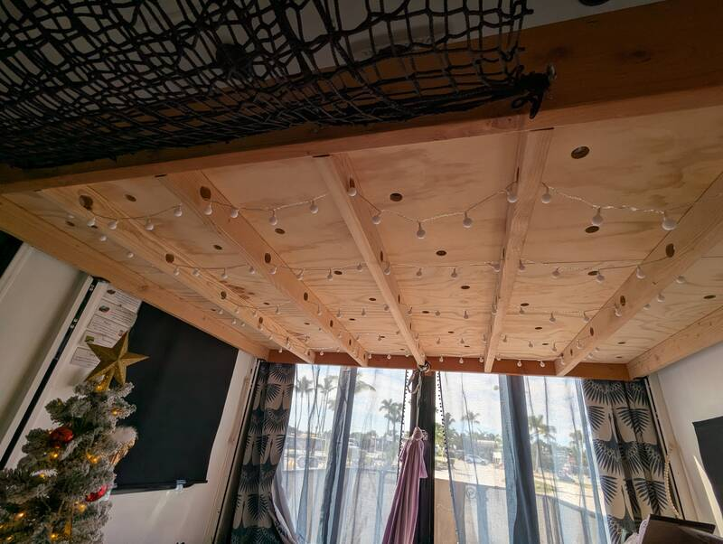
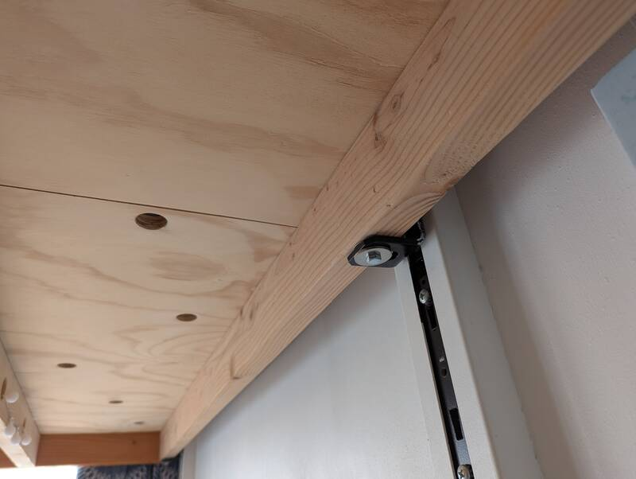
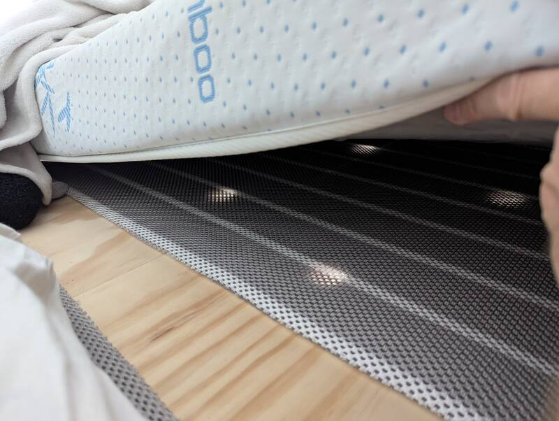
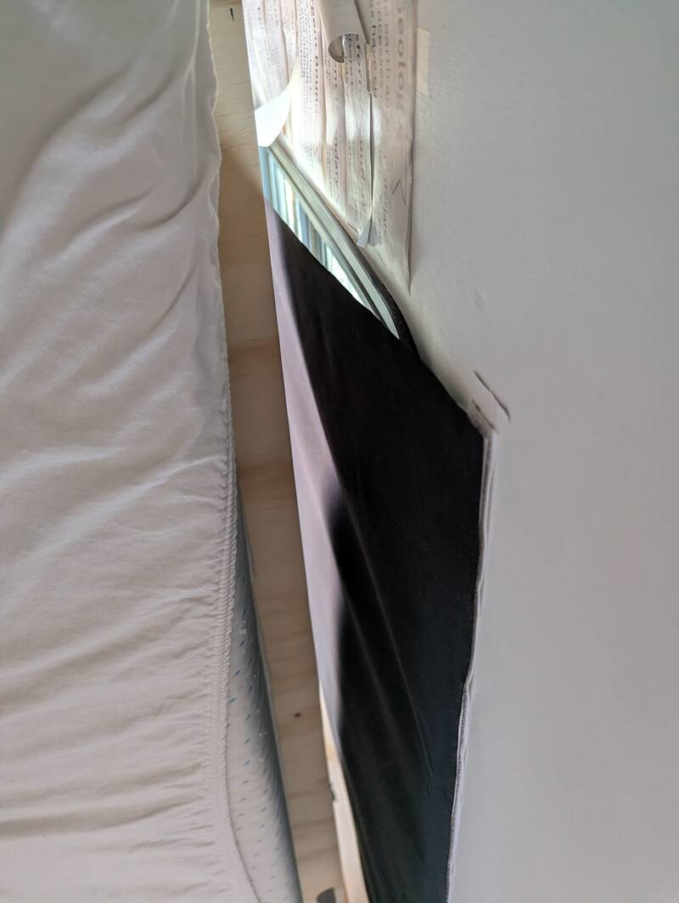
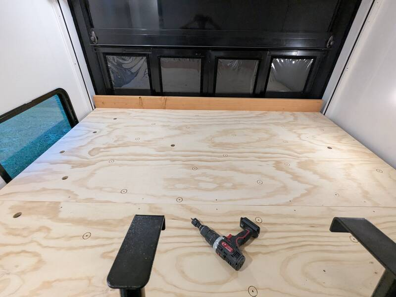

# Kids Bed: King Bed on the HappiJac Lift

[Back to Overview](../README.md)

- Time: 3 days
- Money: 150$ lumber + 150$/Mattress + 50$ mold protector

## Goal

Three kids sleeping length-wise on the king bed. Each with their own mattress
and a little spacer in between for water bottles, books or toys.

## Photos

  
  

  
  

  
  

## Dimensions

- 75-1/4" long x 92-3/8" wide (leave a little wiggle-room on the side of the
  HappiJac support even if you don't need curtains on the side windows)
- 1-1/2" wide holes at 12-5/8" interval on the 2x4 trusses.

  The hole closest to a beam's end starts at 1-3/4" away from the end. Don't go
  closer to avoid visible screws and for structural integrity.

- 1-1/4" wide holes on the 3/4" plywood. Six holes in between trusses (~13-5/8"
  apart) always 3 in a diagonal with the 6 hole pattern repeated at an offset in
  between trusses to avoid a weak-line.

## Materials

- [2x10 for front and back](https://www.homedepot.com/p/2-in-x-10-in-x-8-ft-2-Premium-Grade-Fir-Dimensional-Lumber-915564/206182030)
- [2x4 beams](https://www.homedepot.com/p/2-in-x-4-in-x-96-in-2-Premium-Grade-KD-HT-Stud-058449/312528776)
- [1/4 x 1-1/4 Fender Washers](https://www.homedepot.com/p/Everbilt-1-4-in-x-1-1-4-in-Stainless-Fender-Washer-20-Pack-807792/204284509)
- [Hole Saw](https://www.amazon.com/KATA-25-54mm-Mandrels-Drill-Plywood/dp/B0CSDDV2BQ?tag=rvlifehacks-20)
  for beams underneath and plywood board.

- [72x28x4" Latex Mattress](https://www.amazon.com/Greaton-4-Inch-High-Density-Replacement-Application/dp/B0BXYFHCNY?tag=rvlifehacks-20)
- [Mattress Mold Protector](https://www.amazon.com/Mattress-Breathable-Meshfiber-Ventilation-Aire-Flow/dp/B0DJS3HHQ3?tag=rvlifehacks-20)
- [Lightbulb Chain](https://www.amazon.com/WERTIOO-Battery-Operated-Control-Christmas/dp/B074QJZQ4M?tag=rvlifehacks-20)
  Just for decoration

## Notes

- It takes a lot of time to sand down all the beams with 80, then 240 grit even
  with the
  [Orbital sander](https://www.amazon.com/DEWALT-Random-Variable-DWE6423-Renewed/dp/B09YVXVNCX?tag=rvlifehacks-20)
  (renewed, great value)
- Lots of
  [Sandpaper](https://www.amazon.com/WORKPRO-150-piece-Sandpaper-Set-Different/dp/B07HHY6MKY?tag=rvlifehacks-20)
  Cheap but one will only do about two-three 2"x4"x8' beams
- Treat at least the headboard with Polyurethane. I only did 1-2 coats of
  oil-based but it makes a huge difference with the fingerprints. The beams
  underneath or the plywood are sanded but untreated.
- Use 2 hex-head lag-screws on each side to hold the 2x4 trusses to the 2x10
  front and back board.
- Use 2 fender washers on the HappiJac support to allow for some movement while
  the lift carries the bed up and down or while shaking during transport. The
  original HappiJac Queen bed has two welded on brackets to go on the one used
  here and allows for quite some lateral movement.
- Drilling with the hole saw takes a lot of time and many packs of batteries. A
  wired drill is a much better option for the hole saw, but if you don't have
  one it's doable. Despite the time effort, I would definitely do those again.
  - Don't drill into the load-bearing planks on the two sides.
  - Interleave holes such that the weak point is not one line across the bed.
  - For the plywood board, measure out the holes in one section and create a
    cardboard template between two supporting beams. Then reuse that for all
    sections for an even hole pattern.

    

[Back to Overview](../README.md)
