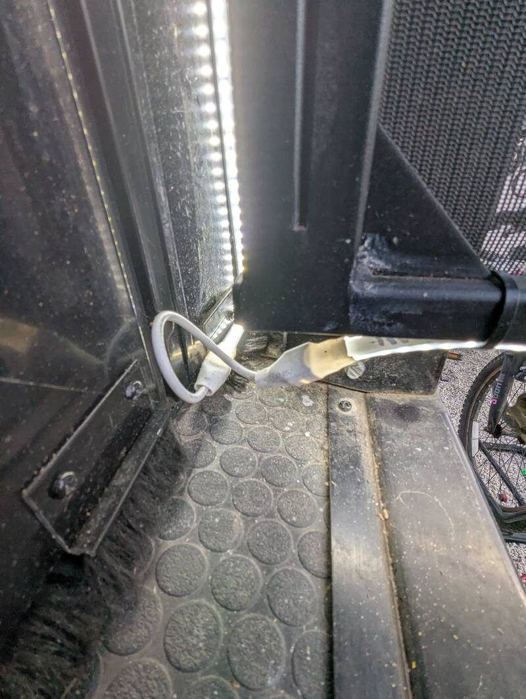
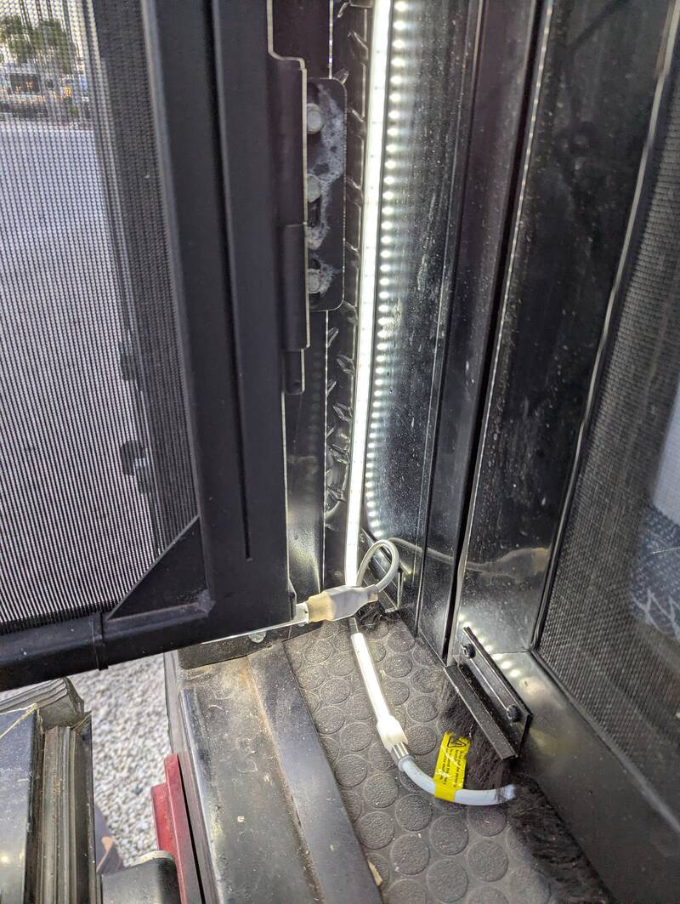
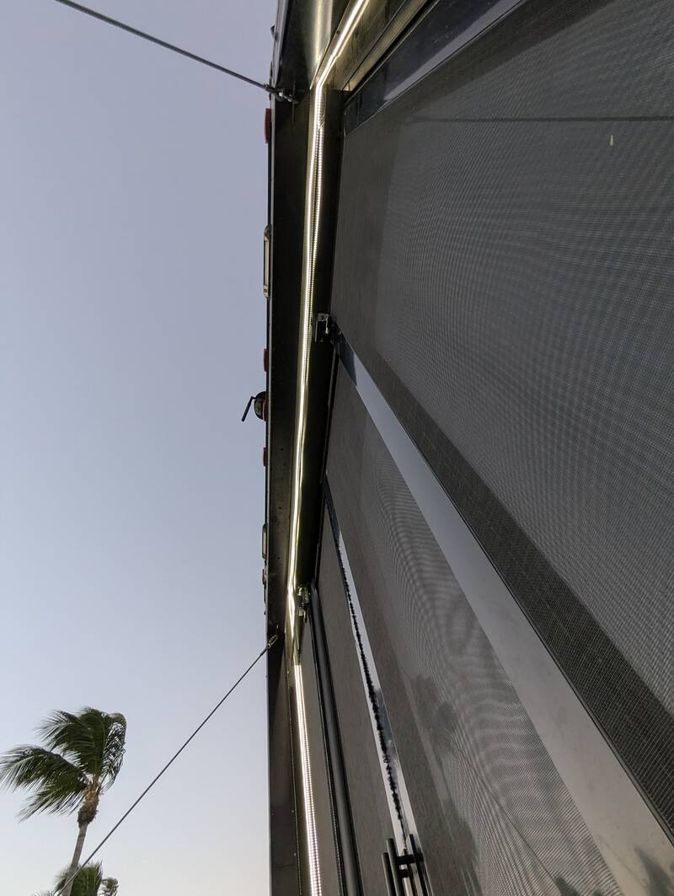

# LED Lighting on Deck & Ramp

[Back to Overview](../README.md)

- Time: 1 day
- Money: $200

## Project Goal

Indirect decorating lighting on the deck

## Photos

  
  

  
  

## Materials

- [Cheap Soldering Iron Kit](https://www.amazon.com/Liouhoum-Auto-Sleep-Adjustable-Temperature-Thermostatic/dp/B08PZBPXLZ?tag=rvlifehacks-20)
  After trying for a while with the small tip, the smallest tip worked much
  better on the joint leads.
- [Silicone Adhesive](https://www.amazon.com/Permatex-80050-Silicone-Adhesive-Sealant/dp/B0002UEPVI?tag=rvlifehacks-20)
  to seal the connectors before shrink-wrapping
- [Dimmer](https://www.amazon.com/Shine-Decor-Dimmer-Controller-Remote/dp/B0C992QJWZ?tag=rvlifehacks-20)
  way too bright without and adds functions like fading or flashing.
- [50ft cuttable LED Strip](https://www.amazon.com/Shine-Decor-Adhesive-Waterproof-Non-flicker/dp/B0CZRTTFKV?tag=rvlifehacks-20)
  cuttable every 4".
- [LED Connection Wires 5pcs](https://www.amazon.com/Shine-Decor-Connecting-Wires-Flexible/dp/B0CBTSN71D?tag=rvlifehacks-20).
  For the Y-junction, one of those is cut apart and the loose wires soldered
  directly onto the connection pads of the cuttable LED strip.

## Implementation

- Cold 110V AC LED strips (12V or colored LED strips would also work) Since the
  whole strip draws about 150W I decided to go with the 110V because of the
  voltage drop on 12V.
- Soldered and waterproofed junction
- Routed along railings and hinges

## Photos

  
  

  

## Notes

- Way too bright at 100%, use dimmer and check if you prefer warm-white (I did
  natural daylight/cold light)
- 110V keeps the wires thin with such long strips
- Push-connect seems flaky. Make sure the strips are tested prior to
  water-proofing with silicone glue and shrink tubing.
- The 6" loops on the hinges work well when folding the railing and are not in
  the way when stored for transport.
- Spray painting the white connectors with black enamel worked well and makes
  them harder to distinguish from the railing.

[Back to Overview](../README.md)
