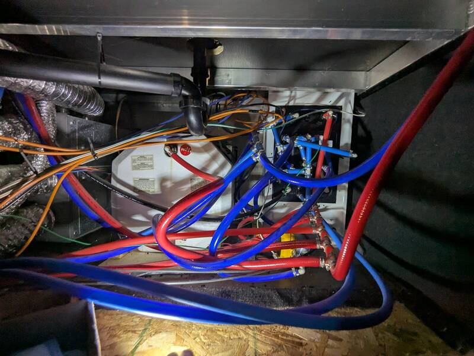

# Additional Basement Storage Space

[Back to Overview](../README.md)

- Time: 2h
- Money: 50$

## Goal

Add more otherwise wasted storage space to the basement. By turning the last two
outlets on the water manifold mess by 90° I get about 12-15ft³ of extra storage.
By leaving off the panel, I gain another few ft³.

Other perks of the projects are easy access to water manifold, access to the
furnace, water heater, electricity panel, etc.

## Photos

  
  

## Material

### Water

- [1/2" PEX Valves 10Pcs Red/Blue](https://www.amazon.com/EFIELD-Brass-Valve-Certified-10-Pieces/dp/B085RV5SRY?tag=rvlifehacks-20)
- [PEX Crimp Tool Kit](https://www.amazon.com/Crimping-Fitting-Crimper-Stainless-Including/dp/B0B3978PGK?tag=rvlivehacks-20)
  Great value tool, includes enough clamps to get you started. I've used it
  countless times since. Also comes with a handy pipe-cutter for those 1-1/2"
  ABS pipes on the drains.

### Heating

- [2" HVAC Tape 65'](https://www.amazon.com/Aluminum-Insulation-Adhesive-Temperature-Ductwork/dp/B09BHWMSTD/ref=sr_1_3?tag=rvlifehacks-20)
  Use smaller bits of tape to patch the hole, then use two big ones to go around
  the whole pipe twice to ensure it stays in place.
- [4" straight heating vent coupler](https://www.amazon.com/Lambro-244-Duct-Connector/dp/B00438NXKY?tag=rvlifehacks-20)
  Use this and HVAC tape to couple to pieces of heat ducting. For the damage in
  the picture above, I ended up using a 4" 90° angle since it fit better than
  the straight coupler I had originally bought for this.

## Process

- Unscrew the panels
- Stash the panels away or cut them to size.
- Check water manifold and water heater for any leaks, esp. on the garden-hose
  type pipes. The PEX pipes seem way more reliable. If any are leaking, cut
  about an inch off the hose, replace the clamps and add a valve. Preferably use
  PEX for the new bit where you inserted the valve.
- Check heater ducting for damage (rodents or just vibrations at an edge)
- Redirect that long mess of a manifold by re-clamping the shark-bite clamps
  (insert those valves, it'll come in handy eventually).

[Back to Overview](../README.md)
