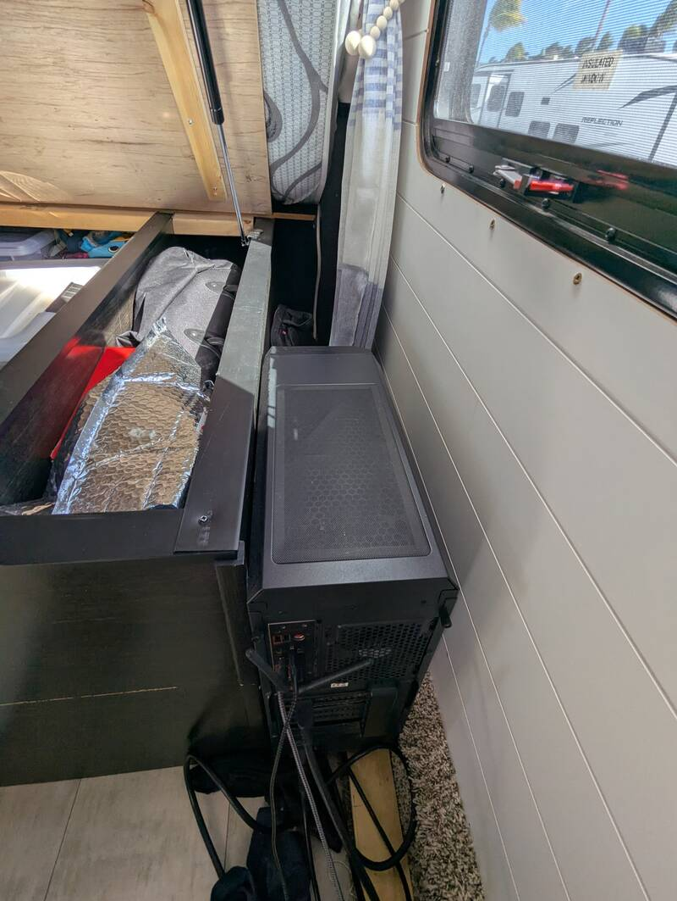
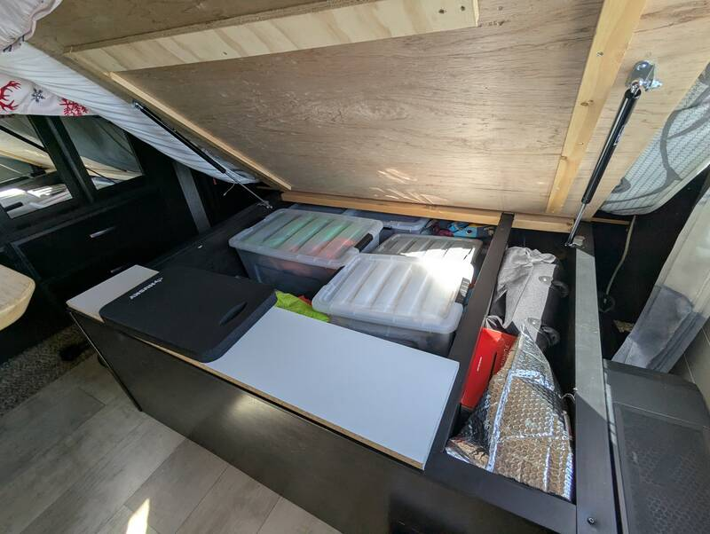

# Office Desk

- Time: < 1 day
- Money: $150

## Goal

Full-fledged office desk for remote-work in the master bedroom (away from kids)

## Material

Desk:

- [Office Desk Hinges](https://www.amazon.com/Mac-Sports-Collapsible-Outdoor-Utility/dp/B072JWBP66?tag=rvlifehacks-20)
  Sturdy hinges for an office-desk
- [Anfallare IKEA Bambool Table-Top](https://www.ikea.com/us/en/p/anfallare-tabletop-bamboo-00465141/)
  although it looks nice, I recommend a real wooden desk board as the IKEA one
  will need internal reinforcement.
- 2-1/2" lag screws (2 screws per hinge into stud) - I use Robertson (#2 square
  drive) all over the RV
- 3/4" lag screw (3 screws per hinge into table top)

Screen Mount:

- [Office Screen Wall Mount](https://www.amazon.com/WALI-Articulating-Monitor-Extension-100x100/dp/B01BCUM766?tag=rvlifehacks-20)
  Sturdy single-stud mount for the screen. I use a 34" curved Samsung monitor
  with a built-in USB hub.

Sideboard:

- [Melamine Board](https://www.homedepot.com/p/Veranda-3-4-in-x-4-ft-x-8-ft-Melamine-White-Particleboard-Panel-461877/100070209)
- [6" Shelf Brackets](https://www.homedepot.com/p/Everbilt-6-in-x-8-in-White-Shelf-Bracket-15418/202034287)
  Need two
- 1/2" screws bracket into sideboard. 3pcs per bracket.
- 2-12" lag screw bracket into stud. 3pcs per bracket.

## Dimensions

- Desk height 39" (floor to top of desk) - works great as standing desk or
  sitting desk with the bed either up (bed with gas struts acts headrest) or
  down for a person 5'10" tall.
- Table-top height: 1"
- Desk depth 24-1/2"
- Desk width 40" (so I can also use it with the slide-out retracted)

## Photos

  
  

  
  

## Notes

### Desk

- Mount hinges on studs
- This IKEA desk is filled with actual cardboard. Cutting the desk to size
  requires cutting off the edge piece and reattaching it (glue + screws).
- The wood is solid enough so you can attach something on the 3" on the side of
  the desk (narrow edge) or on the 2" on the front and rear (long edge)
- Parts of the middle of this desk are now filled with a half-inch plywood board
  that I shoved in to reinforce it for mounting the hinges.

### Sideboard

For holding keyboard, mousepad and mouse, coffee mug, etc. so the desk can be
folded down and the passage can be walked through.

- Top of desk to bottom of sideboard: 4-3/8"
- Cut to 6" for sideboard between desk and screen (or your desired width, just
  make sure the brackets aren't longer)
- I shortened the bottom of the brackets with an angle grinder to 2-1/2". It's
  still strong enough.
- The remainder of the board (~9-1/2" wide) is used as hard sitting surface over
  the bed. I use a
  [Husky Kneeling Pad](https://www.homedepot.com/p/Husky-Kneeling-Pad-GD220568/321999865)
  to put on the board to sit on.
