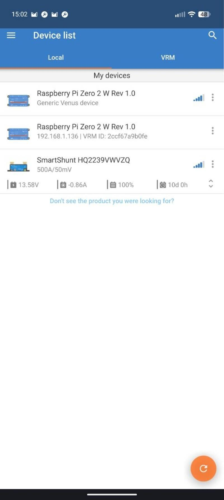
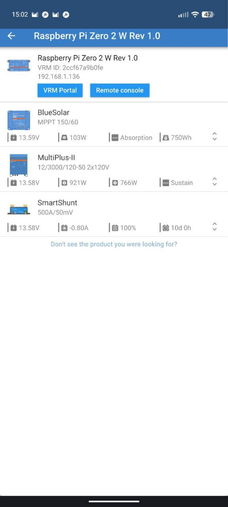
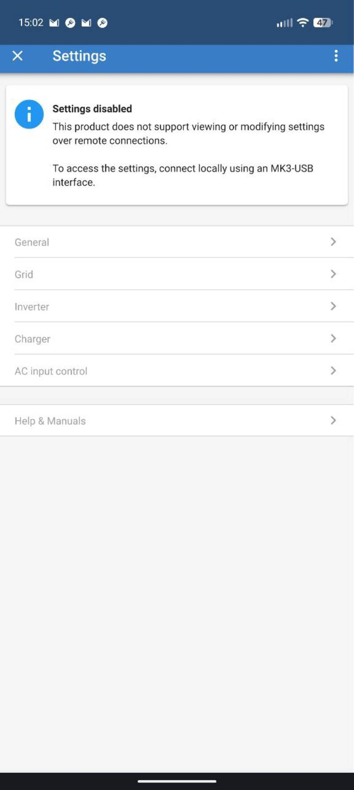
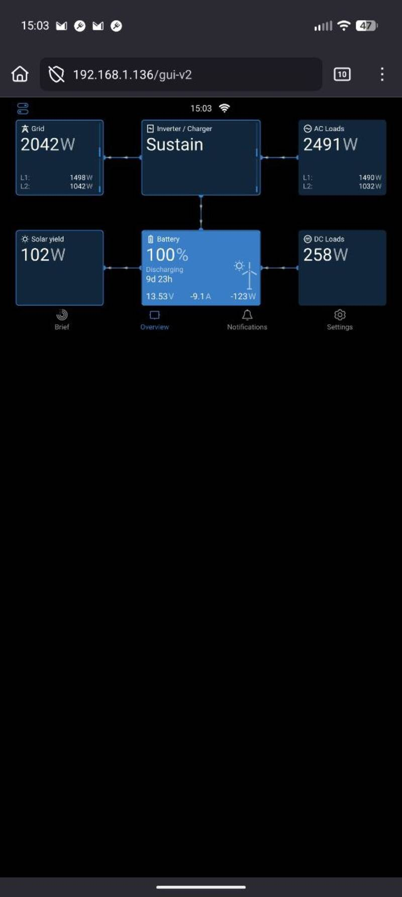

# Raspberry Pi Zero 2W Venus OS

[Back to Overview](../README.md)

- Time: 2-4 hours
- Money: ~$100-150 (Victron USB cables dominate the costs)

## Goal

Get the inverter, MPPTs and SmartShunt to work together with a cheaper, more
customizable solution than the
[Victron Cerbo GX MK2](https://www.amazon.com/Victron-Energy-Cerbo-GX-MK2/dp/B0D6LVZWGX?tag=rvlifehacks-20).

### Alternative: GX Devices

Note that if you go with the Victron Cerbo GX solution, get the slightly cheaper
VE.bus/VE.direct cables, not the USB ones. There also seems to be GX-enabled
Multiplus solutions available that may have the VE.bus/VE.direct connectors.

## System Overview

The Raspberry Pi Zero 2W interfaces with:

- 2x Blue Solar MPPT charge controllers (via VE.Direct USB)
- 1x Smart Shunt battery monitor (via VE.Direct USB)
- 1x Multiplus II 2x120V 3000W inverter/charger (via VE.Bus MK3 USB)

The Pi exposes itself as a BLE device for initial WiFi configuration using the
Victron app. Note: The Pi does not connect to the BLE-enabled SmartShunt;
connection is via VE.Direct USB only.

The Pi Zero 2W draws about 1W with light loads (such as this).

## Materials

- [Raspberry Pi Zero 2 WH](https://www.amazon.com/Raspberry-Pi-Zero-2-WH/dp/B0DB2JBD9C?tag=rvlifehacks-20)
  The Zero 2 WH comes with pre-soldered headers.

- [GeeekPi Case and Heatsink](https://www.amazon.com/GeeekPi-Raspberry-Aluminum-Adapter-Heatsink/dp/B0BJ1WFGMN?tag=rvlifehacks-20)
  Aluminum case with heatsink that doesn't block wireless signals. Includes
  micro-USB to USB-A adapter for connecting the USB hub.

- [Powered 4-Port USB 2.0 Hub](https://www.amazon.com/dp/B0BKZK4KGH?tag=rvlifehacks-20)
  Use a USB 2.0 hub. Powered is a must if you have more than 3 cables.

  The Pi Zero 2W does not do well with USB-C hubs. Even when not powered, it
  did not work. The devices enumerated on the shell but Venus was not able to
  pick them up because coms failed.

- [MicroSD Card 256GB](https://www.amazon.com/SAMSUNG-microSDXC-Expanded-MB-ME256KA-AM/dp/B09B1GXM16?tag=rvlifehacks-20)
  Venus OS "large" variant image uses ~3.5GB unpacked. 256GB provides plenty of
  room for data logging. Minimum recommended: 16-32GB.

- Micro-USB power cable (not included with case)
- [VE.Direct to USB cables](https://www.amazon.com/Victron-Energy-VE-Direct-USB-Cable/dp/B01LZ6WTLW?tag=rvlifehacks-20)
  One for each MPPT solar controller and SmartShunt
- [MK3 VE.bus USB cable](https://www.amazon.com/Interface-MK3-USB-C-VE-Bus-to-USB-C/dp/B0BNBVKSTH?tag=rvlifehacks-20)
  for Multiplus II Inverter

## Initial Setup

### 1. Install Venus OS

Download the
[latest Venus OS image](http://updates.victronenergy.com/feeds/venus/release/images/raspberrypi2/venus-image-large-raspberrypi2.wic.gz)
for Raspberry Pi 2 from the
[Victron website](http://updates.victronenergy.com/feeds/venus/release/images/raspberrypi2/)
and flash it to the microSD card using a tool like
[Raspberry Pi Imager](https://www.raspberrypi.com/software/) or Etcher.

### 2. Hardware Assembly

1. Install the Raspberry Pi Zero 2W into the GeeekPi aluminum case with heatsink
2. Insert the microSD card
3. Connect the USB hub using the micro-USB to USB-A adapter. The hub only works
   on the Pi's USB port that is not marked PWR. The reverse works and you can
   power the Pi through the coms port. So if later you don't see the USB devices
   in the console, try swapping the ports.
4. Connect VE.Direct cables to the USB hub for the two Blue Solar MPPTs and
   SmartShunt
5. Connect the VE.Bus MK3-USB cable to the USB-C port for the Multiplus
6. Power the Pi with a micro-USB power cable

### 3. Initial WiFi Configuration via Bluetooth

1. Download the Victron Connect app on your phone and go stand in BLE range of
   the Pi - within 3-10ft to be safe.
2. Open Victron Connect and look for the Venus OS device in the Bluetooth device
   list

   

3. Connect to the Venus OS device
4. Navigate to the network settings and configure your WiFi credentials
5. The Pi will connect to your WiFi network and be accessible via the Remote
   Console. Also, the Pi will be connectable by WiFi even if outside of BLE
   range.

   

## System Configuration

### Enable DVCC (Distributed Voltage and Current Control)

DVCC centralizes battery management across all Victron devices:

1. Go to **Settings** → **System Setup** → **Charge Control**
2. Enable **DVCC**, **SVS - Shared Voltage Sense**, **SCS - Shared Current
   Sense** and **STS - Shared Temperature Control**
3. Configure voltage limits and current limits as appropriate for your battery
   system
4. Enable **SVS (Shared Voltage Sense)** if using compatible devices
5. Enable **SCS (Shared Current Sense)** to share current measurements

### Configure ESS (Energy Storage System)

ESS manages how your system uses battery power and grid/generator power:

1. Go to **Settings** → **System Setup** → **ESS**

TODO: figure out how to configure that. Currently shows "No ESS assistant
found."

## Important Notes

### Multiplus Configuration Limitations

Settings on the Multiplus II inverter/charger cannot be changed through Venus
OS. To modify Multiplus settings:

- You must connect directly to the Multiplus via VE.Bus MK3 USB cable using the
  Victron Connect app on your phone
- Or use the VE.Bus MK3-USB interface with VEConfigure software on a computer

### SmartShunt Connectivity

The SmartShunt connects via VE.Direct USB cable only. The Pi can't use the
SmartShunt's Bluetooth capability.

## Monitoring and Remote Access

Once configured, you can:

- Access the Remote Console via web browser at `http://venus.local` or
  `https://<venus-ip-address>`

  

- Use the VRM (Victron Remote Management) portal for cloud-based monitoring. I
  don't use it.
- View all connected devices and their status
- Monitor solar production, battery state, and power consumption
- Control ESS settings and view historical data

## Troubleshooting

- If devices don't appear, check USB cable connections and ensure all devices
  are powered
- For VE.Direct connection issues, verify cables are genuine Victron VE.Direct
  to USB cables
- If BLE WiFi setup doesn't work, you can configure WiFi by editing files on the
  SD card before first boot
- Check Venus OS logs via SSH in `/var/log/` for detailed error messages

## Enabling SSH Access

Not necessary if you don't want to use the Pi for anything else. To access your
Raspberry Pi via SSH for advanced configuration:

### Enable Superuser Access

1. In the Venus OS interface, go to **Settings** → **General**
2. Set **Access Level** to **User and installer** (default password is blank,
   just press OK)
3. Highlight **Access Level** (stay on the General page, don't open the Access
   Level submenu)
4. Press and hold the right arrow button until the Access Level changes to
   **Superuser**
   - When using Remote Console in a web browser, use the right arrow key on your
     keyboard
   - Mouse clicks won't work for this action

### Enable SSH on LAN

1. While still in **Settings** → **General** with Superuser access
2. Find and enable **SSH on LAN**
3. You can now SSH to the Pi using `ssh root@<venus-ip-address>`

### Set Root Password

1. SSH into the Pi
2. Run `passwd` to set a root password
3. Follow the prompts to enter and confirm your new password

[Back to Overview](../README.md)
