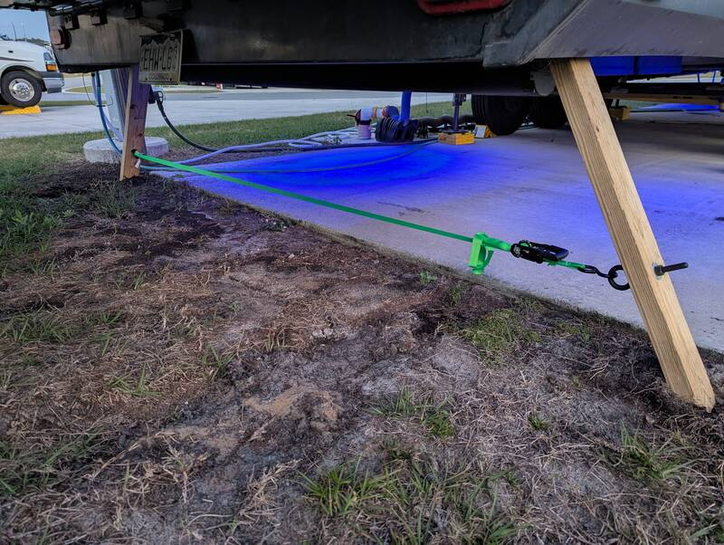
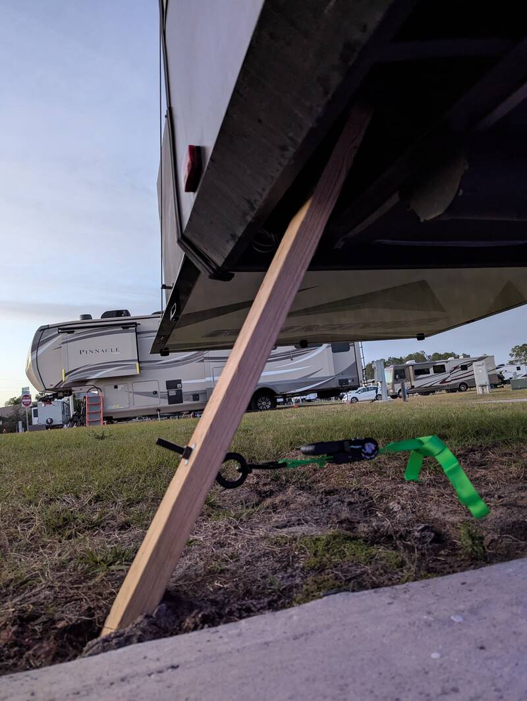
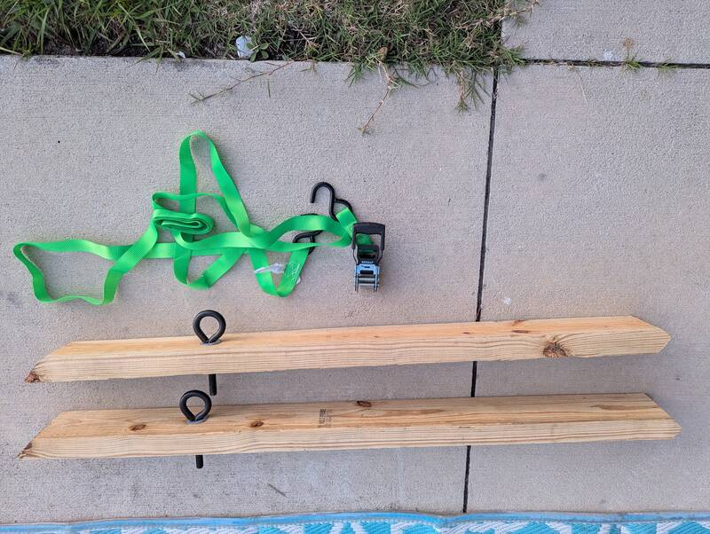
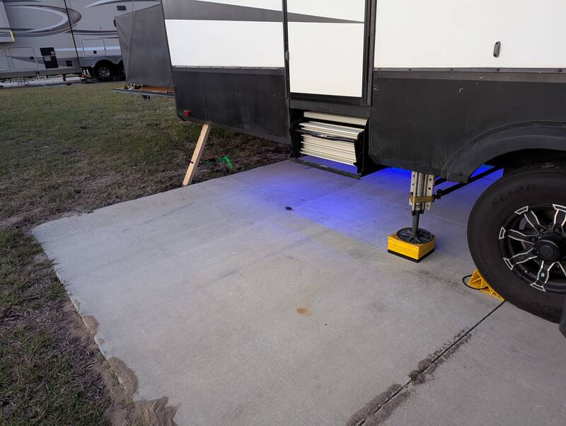
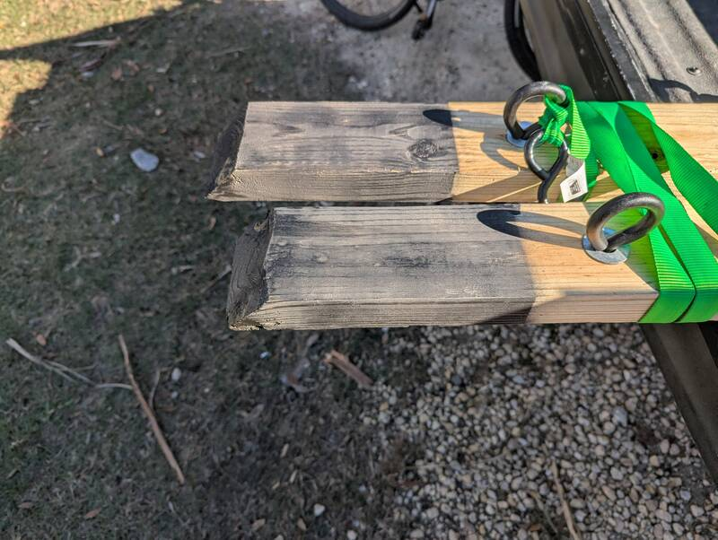

# Rear Stabilizers

[Back to Overview](../README.md)

- Time: 2h
- Money: $20

## Goal

Better RV stability with improvised rear jacks.

### Off the Shelf Alternatives

- If your RV has a rear hitch receiver, you can also consider a product like
  this
  [Adjustable hitch mount stabilizer](https://www.amazon.com/GADFISH-Adjustable-Stabilizer-Foldable-Universal/dp/B0FWRMKRKN?tag=rvlifehacks-20)
  which likely provides better front-back stabilization but a little less
  sideways stabilization.
- Alternatively, there's also an
  [Adjustable stabilizing bench](https://www.amazon.com/Beech-Lane-Universal-Stabilizer-Adjustable/dp/B0BKB3J2L3?tag=rvlifehacks-20)
  for under the rear bumper (1pack) or the
  [2pack](https://www.amazon.com/Beech-Lane-Universal-Stabilizer-Adjustable/dp/B0BYTB38PT?tag=rvlifehacks-20)
  for on each side under the I-beam if the added costs and storage don't put you off. Note that
  although aluminum will not rust, galvanic corrosion could become an issue if your I-beam is rusty
  and there's moisture between both pieces so I'd use a plastic foam sheet to insulate. This product
  works for up to 26.5" ground clearance.

## Photos

  
  

  
  

## Materials

- 1x Pressure treated 2x4 8-12ft long from Home Depot (measure what you need at
  a 45° angle)
- 2x 3/8" stainless Eye-bolt with machine thread and a corresponding nut (5/16"
  also works)
- 4x 1/2" stainless Washer (one for each side of the hole)
- 14ft ratchet strap. I used a cheap 5$ one but despite the 1500lbs strap
  rating, the ratchet will likely not survive clamping with more than 120lbs. If
  you want that, use a
  [heavy-duty ratchet](https://www.amazon.com/DEWALT-DXBC50002-Yellow-Ratchet-Straps/dp/B0BYKDSZQT?tag=rvlifehacks-20).
  With a heavy duty one, use the 3/8" eye-bolt.
- Black spray can (my 2x4 was still too fresh/wet, so it's not sprayed yet)

## Notes

- The added stability is noticeable but not absolutely necessary. For 2 night
  stops I likely won't bother setting up the contraption unless we're running
  the washer.
- I did two campers at the same time. The distance will depend on the slope,
  where on your I-beam you wedge your stabilizer and how deep it digs itself
  into the ground. Make sure the maximum angle does not damage your J-wrap. My
  camper has 42" and 38" planks, the other camper has 56" / 54" since he wanted
  to go wider and his J-wrap permits the wider 45° angle.
- Cut the 2x4 at 45° angle on one side (bottom) and form a 90° point with two
  45° angle cuts from both sides on the top side where the beam is wedged into
  the I-beam.
- This is a good time for a first test to check your length: If it's too long,
  cut again. If you've already cut twice and it's still too short restart at the
  top ;)
- Drill the hole slightly larger than your machine screw.
- Place a washer on both sides of the beam and fix the eye bolt, while keeping
  the eye vertical.
- Spray-paint the 2x4s and let dry or go straight to attaching and tightening
  the ratchet strap.

  

[Back to Overview](../README.md)
