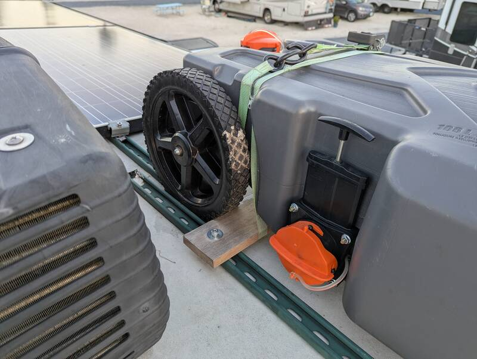
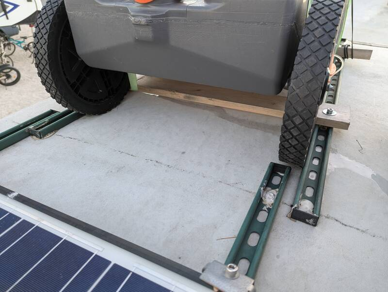

# Storage Efficient Dump Tote Mount on RV Roof

[Back to Overview](../README.md)

- Time: 2h
- Money: 100$ (+250'ish for the tote itself)

## Goal

Efficient dump tote storage for rare/occasional use. **You will need the
strength to be able to lift the tote on a strap** for this as it's not feasible
to climb the ladder one-handed holding the tote. It's not hard, but if you drop
it it could damage your tote and/or the trailer.

## Photos

  
  

  
  

## Materials

- [10ft 14Ga Unistruts](https://www.homedepot.com/p/Superstrut-10-ft-14-Gauge-Half-Slotted-Metal-Framing-Strut-Channel-Green-Urethane-Powder-Coated-ZB1400HS-10GR-ZB1400HS-10GR/100155787)
  10ft is definitely overkill for this but I had leftovers from the solar panel
  install.
- 4 Strut nuts (I used leftovers from the solar clamps), screws and fender washers
- 2 Ratchet Straps. Periodically check for rust.
- [Dicor Self-leveling Lap Sealant](https://www.amazon.com/dp/B00YBFTCZE?tag=rvlifehacks-20)
  Check what other projects you need this for. Keep one spare. Reseal by screwing a screw into the front.
- [Caulk Gun for 10oz tubes](https://www.amazon.com/WORKPRO-10OZ-Adjustable-Force-Caulking/dp/B08T9JTHNK?tag=rvlifehacks-20)
- [28 Ga Tote Tank](https://www.amazon.com/Camco-Rhino-28-Gallon-Tote-Built/dp/B07K87FR5C?tag=rvlifehacks-20)
  Looks like 28Ga is currently unavailable. Available are 21 Ga or 36 Ga with the latter being only 2 lbs heavier.

## Notes

- Does not affect the trailer's height clearance as the AC vent hoods are still taller.
- Use the ratchet straps as pulley to lift/lower tote onto roof.
- Retighten after first drive after each use.
- The wooden cross-members and the unistruts are spaced such that the wheels are
  chocked and the front tote hook hooks onto the beam.
- Don't overtighten the tote vent as elevation changes will inflate/deflate the
  tote.
- Periodically spray the tote with
  [Aerospace Protectant](https://www.amazon.com/303-30313-CSR-Protectant-Plastic-Fiberglass/dp/B00KN0UOEE?tag=rvlifehacks-20)
  to protect from UV damage.

[Back to Overview](../README.md)
