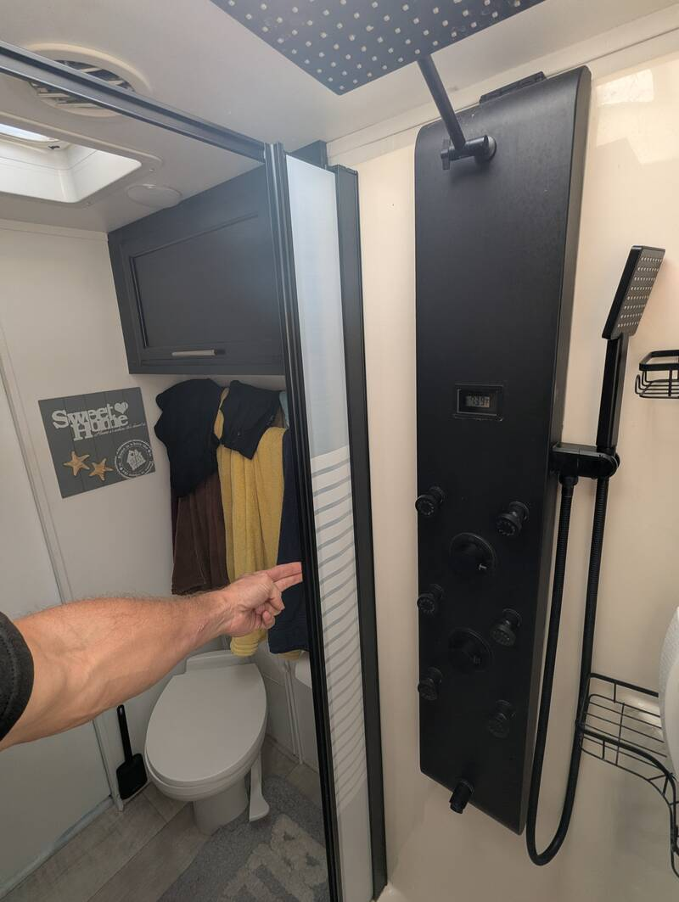
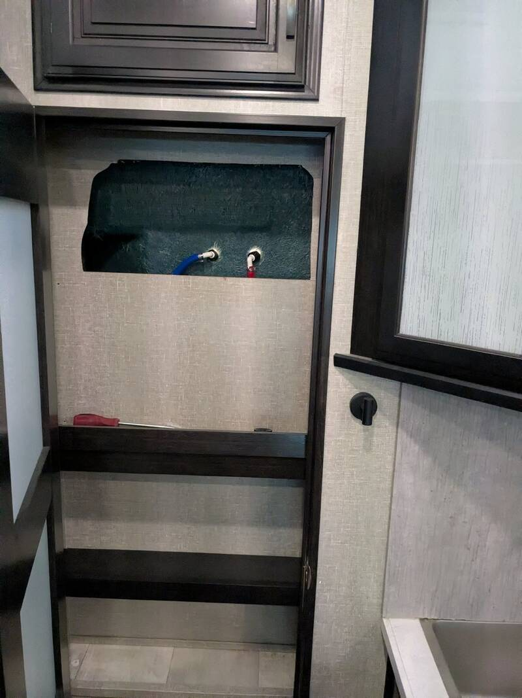

# Shower and Shower Door Replacement

- Time: 4h shower, 4h retractable curtain
- Money: 550$

## Goal

- Replace ugly shower with nice shower.
- Add retractable shower curtain (because the dealer removed the broken one or
  sold it separately?)

## Photos

  
  

## Materials

- [Shower](https://www.amazon.com/MENATT-Stainless-Adjustable-Rainfall-Handheld/dp/B0CRDGC83N?tag=rvlifehacks-20)
- [3/8" OD PEX Adapter](https://www.amazon.com/Uenede-Thread-Fittings-Include-Stainless/dp/B09JNM2X9R?tag=rvlifehacks-20)
  Shower comes with 3/8" screw on. The previous shower had something else. I
  capped the PEX and inserted these. Crimp with the tool below.
- [PEX Crimp Tool Kit](https://www.amazon.com/Crimping-Fitting-Crimper-Stainless-Including/dp/B0B3978PGK?tag=rvlivehacks-20)
- [Retractable Shower Door](https://www.amazon.com/Nautilus-Round-Shower-Opaque-Plain/dp/B0BH3PH5V5?tag=rvlifehacks-20)
- [No Gun Silicone](https://www.amazon.com/GE-Advanced-Silicone-Kitchen-Bathroom/dp/B0C448QB1K?tag=rvlifehacks-20)
  100% silicone. This works and I started with a tube of leftovers I still had,
  but it's just so much easier with the caulk gun that I would strongly
  recommend the caulk gun even if you've never used one.
- [Gun Cartridge Silicone](https://www.amazon.com/Gorilla-Silicone-Waterproof-Resistant-Cartridge/dp/B01NCSN5AS?tag=rvlifehacks-20)
  100% silicone
- [Caulk Gun for 10oz tubes](https://www.amazon.com/WORKPRO-10OZ-Adjustable-Force-Caulking/dp/B08T9JTHNK?tag=rvlifehacks-20)

## Notes

Access the old shower from the pantry! Don't try to bend the fibre-glass shower.

- Caulk around the shower, the inner edges of the shower door and fill up below
  the bottom-bar of the shower door.
- Keep the battery pack on top of the shower. It doesn't fall down or move. If
  you hide it behind as intended, you'll have to remove the whole box to replace
  the batteries. So far batteries are still good after 1/2 year but I wouldn't
  redo the silicone around just to replace them.
