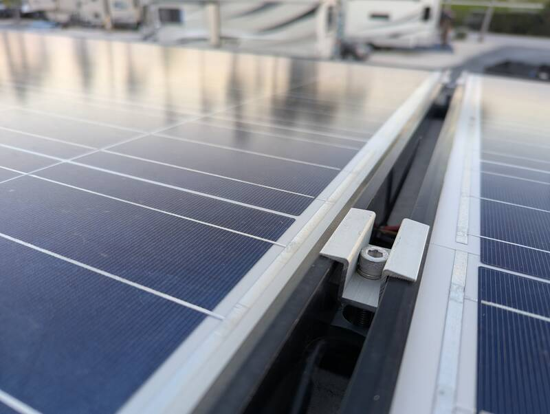
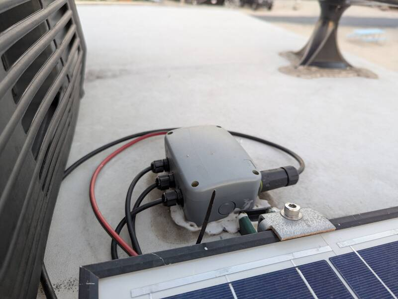

# Solar Mechanic Install

- Time: 3-4 days
- Money: ~$2,000 (TODO: check receipts)

This covers the mechanical aspects of the solar install. See
[Solar Electric](solar-electric.md) for the electric part.

## Goal

Sturdy and road-worthy roof solar install

## Materials
- Solar panels
- [Panel 1-5/8" Unistrut Mid-clamps 10Pcs](https://www.amazon.com/gp/product/B0DGXLQMSZ?tag=rvlifehacks-20) between two adjacent panels.
- [Panel 1-5/8" Unistrut End-clamps 5Pcs](https://www.amazon.com/gp/product/B0DY77RJJF?tag=rvlifehacks-20) at the end of a panel (no adjacent panel.)
- [10ft 14Ga Unistruts](https://www.homedepot.com/p/Superstrut-10-ft-14-Gauge-Half-Slotted-Metal-Framing-Strut-Channel-Green-Urethane-Powder-Coated-ZB1400HS-10GR-ZB1400HS-10GR/100155787)

## Mounting

- Panels clamped to Unistrut
- Torque clamps to 20lbs/ft
- Unistrut bonded and screwed into structure
- Shared roof junction box for Starlink (RJ45) + solar

## Photos

  
  

  
  

## Notes

- Unistrut gives flexibility for future panel changes
- Seal _after_ final torque
- Check where roof trusses are. Dirt lines on roof show roof-panel edges. Magnet
  can be helpful to trace the nails.
- Periodically check stability (so far, no issues after 12k miles)
- Extra unistrut turned into a dump tote mount
