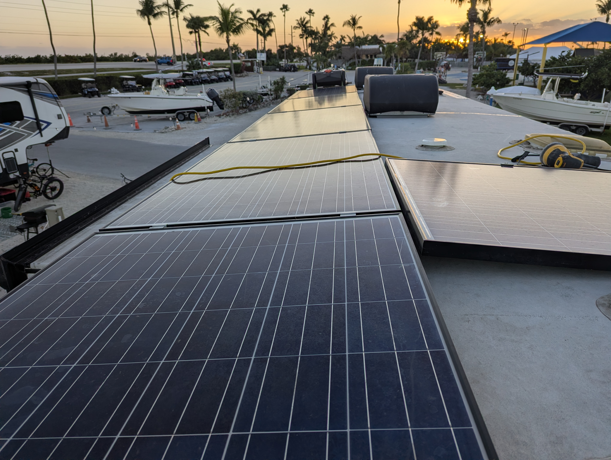
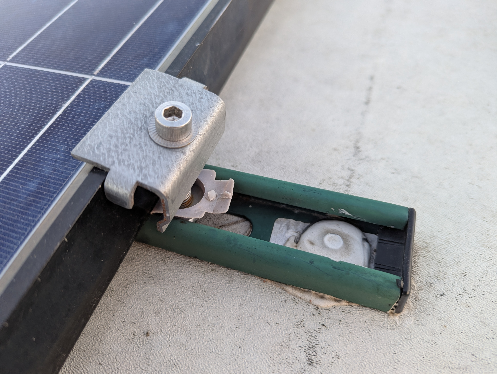

# Solar Mechanic Install

- Time: 3-4 days
- Money: ~$2,000 (TODO: check receipts)

This covers the mechanical aspects of the solar install. See
[Solar Electric](solar-electric.md) for the electric part.

## Goal

Sturdy and road-worthy roof solar install

## Mounting

- Panels clamped to Unistrut
- Torque clamps to 20lbs/ft
- Unistrut bonded and screwed into structure
- Shared roof junction box for Starlink (RJ45) + solar

## Photos

  
  

  
  

## Notes

- Unistrut gives flexibility for future panel changes
- Seal _after_ final torque
- Check where roof trusses are. Dirt lines on roof show roof-panel edges. Magnet
  can be helpful to trace the nails.
- Periodically check stability (so far, no issues after 12k miles)
- Extra unistrut turned into a dump tote mount
