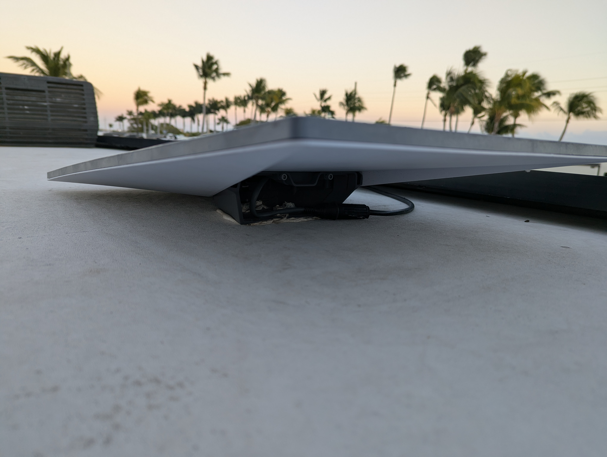
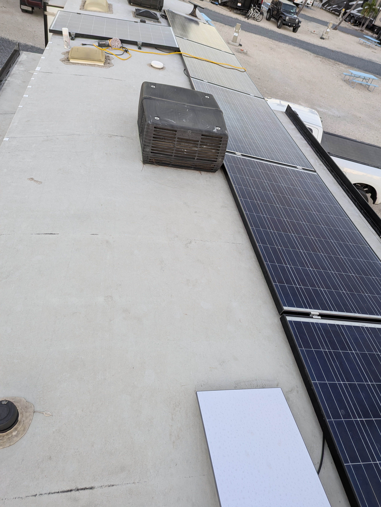
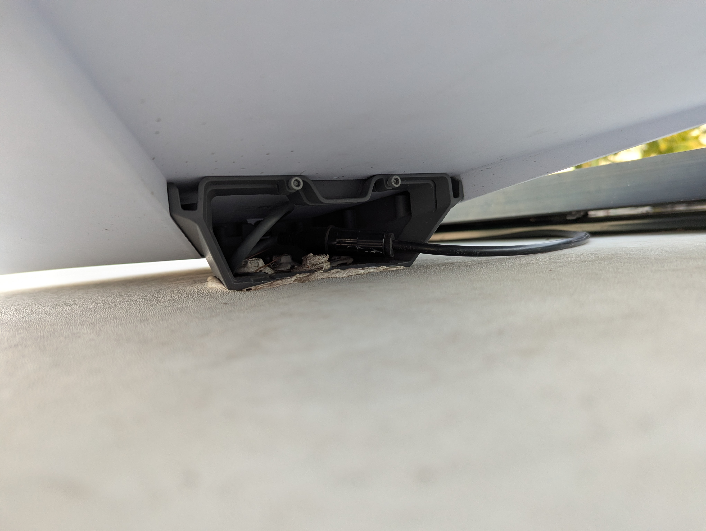

# Starlink on the RV Roof

- Time: 4-5 hours with cabling and setup
- Money: ~300$ (+165$/month unlimited roaming service *or 50$/month for 50Gb*)

## Goal
Permanent (but removable) roof install with clean cabling and weatherproof Ethernet.

## Overview
- Roof-mounted Gen3 Standard Starlink dish
- RJ45 routed through IP68 sealed junction box
- Interior Ethernet drop into basement
- Starlink removable when parked with bad view of sky

## Photos

  
  

  
  

## Notes / Lessons
- Just because the Amazon product says IP68, doesn't mean it is.
- Use Lag screws provided with the Starlink Mobility Mount to fasten to the
  roof
- Dicor sealant (Non-sag or self-leveling) around fasteners
- Junction box on roof allows for replacement of the roof cable without having
  to pull the cabling through the camper
- Leave drip loops on both roof and interior runs
