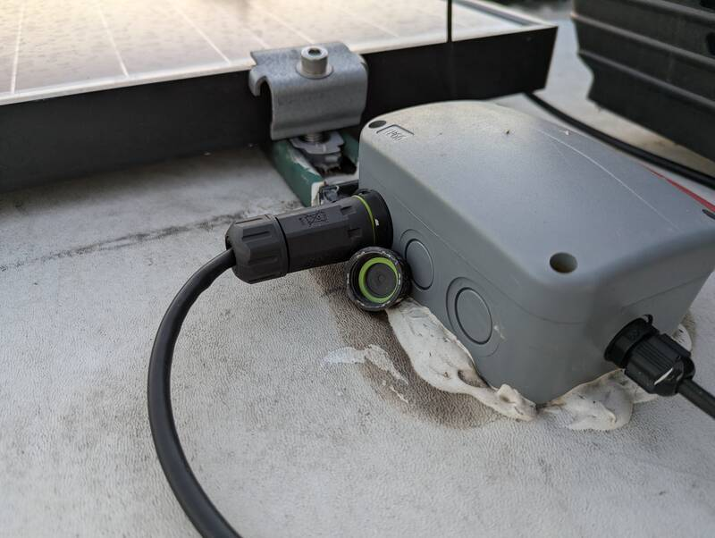
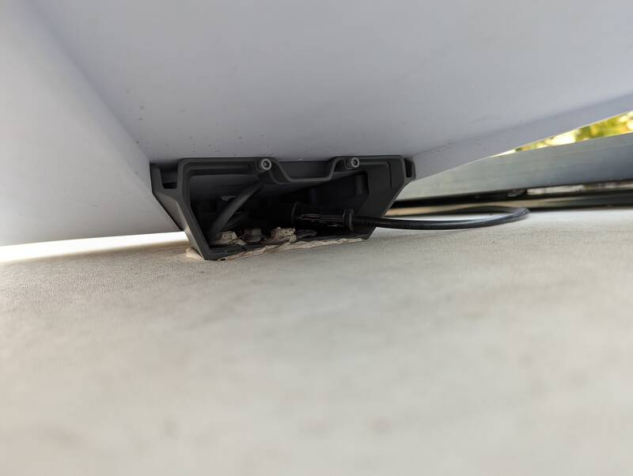

# Starlink on the RV Roof

[Back to Overview](../README.md)

- Time: 4-5 hours with cabling and setup
- Money: ~300$ (+165$/month unlimited roaming service *or 50$/month for 50Gb\*)

[Starlink subscription referral](https://starlink.com/residential?referral=RC-3762258-55110-60&app_source=share)
A free month of Starlink. We wanted to go with cellular and Starlink only when
out of cell range but we blew through the 50G in three days, so now we always
use the Unlimited. Not cheap but definitely worth it. Read our
[Starlink Review](https://bitcreed.us/bitblog/starlink-on-the-road).

## Goal

Permanent but removable roof install with clean cabling and weatherproof
Ethernet. Starlink remains removable when parked with sky-view obstructions.

## Photos

  
  

  

## Materials

- [Starlink Residential 3rd Gen Standard Dish with Subscription](https://starlink.com/residential?referral=RC-3762258-55110-60&app_source=share)
- Starlink Standard Mobility Mount (add during the order)
- [Dicor Self-leveling Lap Sealant](https://www.amazon.com/dp/B00YBFTCZE?tag=rvlifehacks-20)
  Check what other projects you need this for. Keep one spare. Reseal by
  screwing a screw into the front.
- [Caulk Gun for 10oz tubes](https://www.amazon.com/WORKPRO-10OZ-Adjustable-Force-Caulking/dp/B08T9JTHNK?tag=rvlifehacks-20)

## Overview

Use Dicor to seal the roof after mounting the mobility mount with the lag screws
(ideally into the roof trusses.) You can use both self-leveling of non-sag.
Non-sag which is a bit stickier and also works for small repairs on the side of
the roof or for sealing a vent cover for the washer in the side of the RV.

- [Outdoor RJ45 cable CAT6 or more](https://www.amazon.com/Ethernet-Unshielded-Waterproof-Resistant-Internet/dp/B0B14CRJL1?tag=rvlifehacks-20)
- [Waterproof Junction Box](https://www.amazon.com/Dustproof-Waterproof-Universal-Electrical-125x86x62mm/dp/B077QM9VM9?tag=rvlifehacks-20)

- RJ45 Cat6 Ethernet cable routed through an IP68 sealed junction box/gland
- Interior RJ45 Ethernet cable into basement. Check for a Satellite Cable
  Conduit. The 395m comes with a 3/4" PEX tube as conduit. I took it out because
  it was too tight for the RJ45 and the solar electric. Either would fit through
  though.

## Photos

  
  

  
  

## Notes / Lessons

- Just because the Amazon product says IP68, doesn't mean it is.
- Use Lag screws provided with the Starlink Mobility Mount to fasten to the roof
- Dicor sealant (Non-sag or self-leveling) around fasteners
- Junction box on roof allows for replacement of the roof cable without having
  to pull the cabling through the camper
- Leave drip loops on both roof and interior runs so cables aren't fully
  stretched
- Use the kickstand and the Starlink cable that are included with the standard
  dish when you're parked right under a tree. Optionally, the X-frame base might
  make it a bit easier than the kickstand to get optimal orientation. We never
  had need for this though.

[Back to Overview](../README.md)
