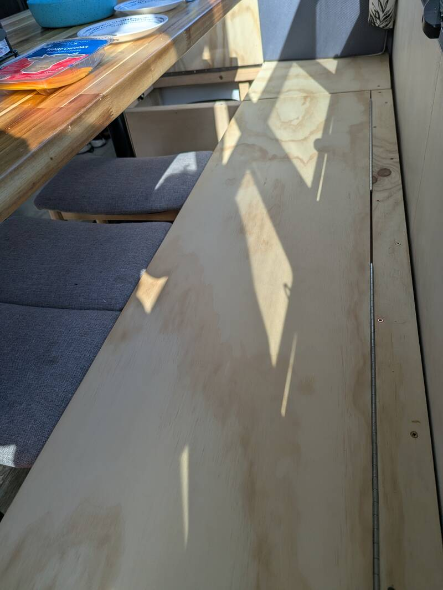
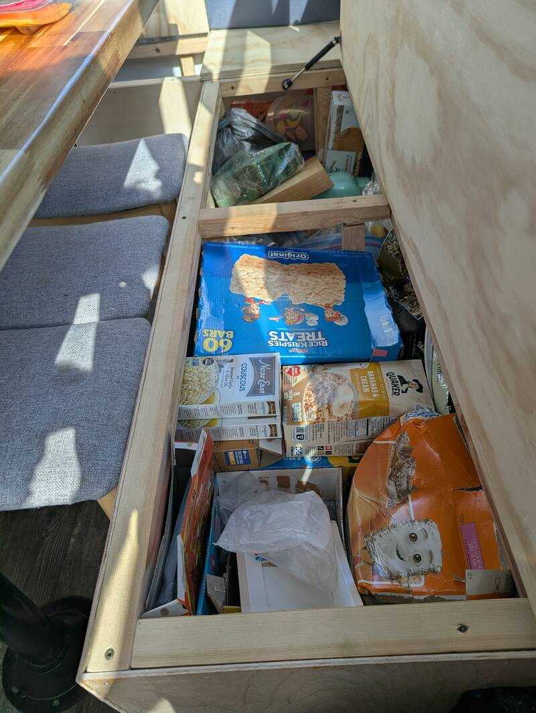
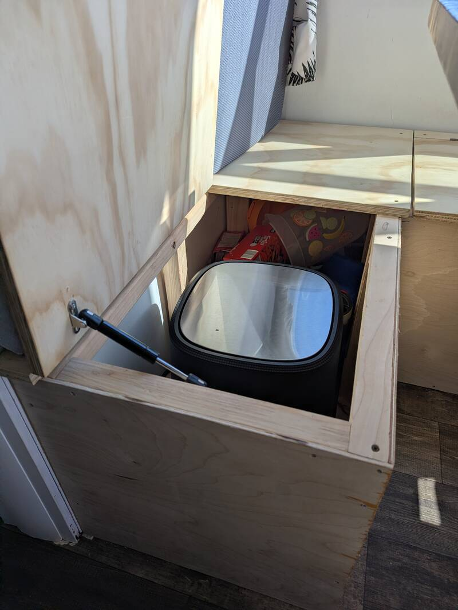
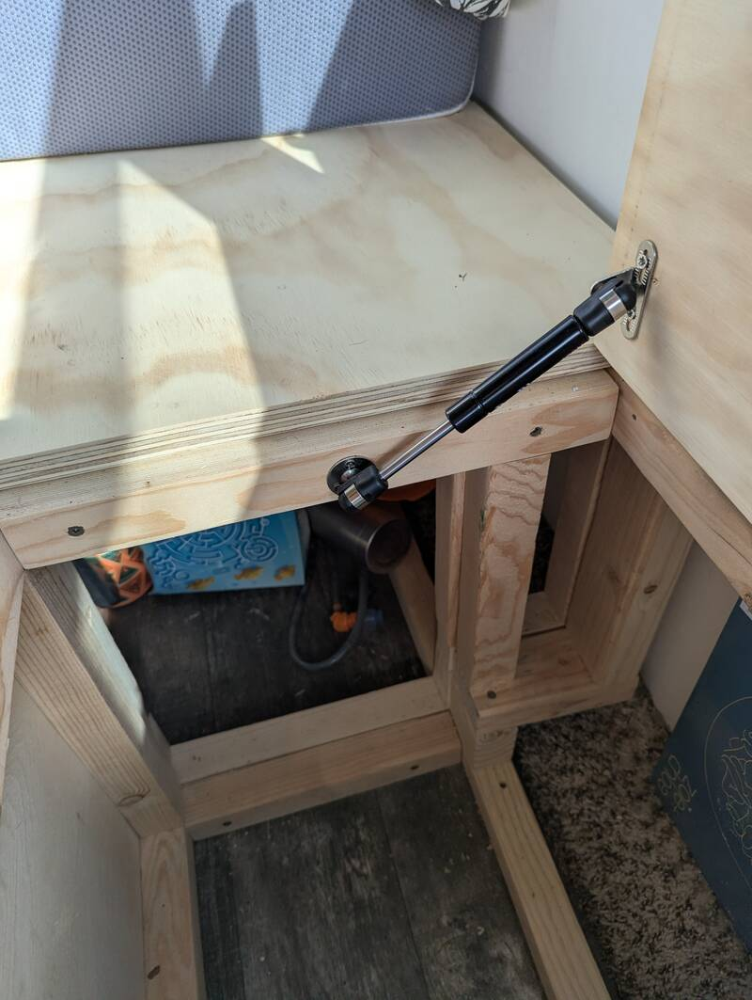
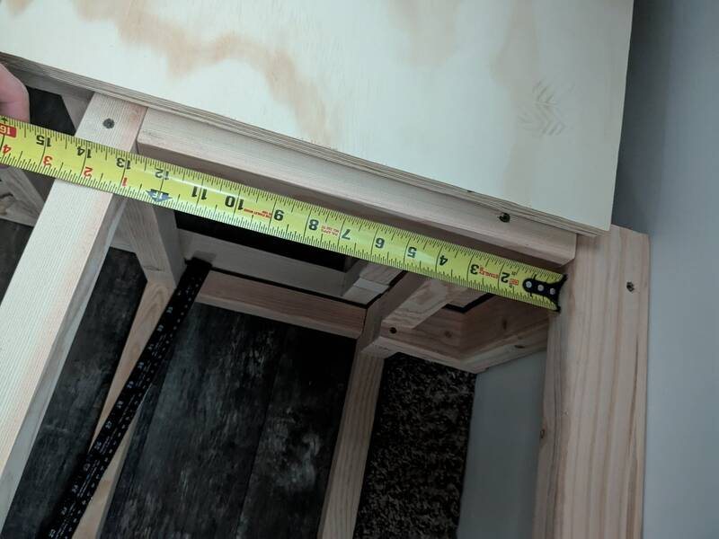
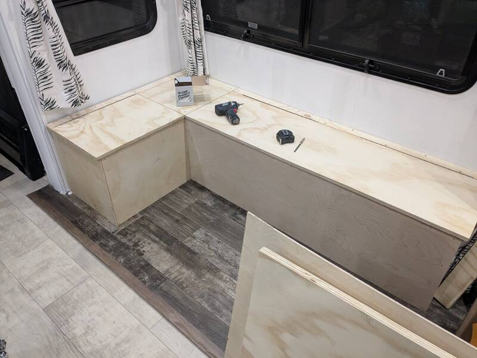
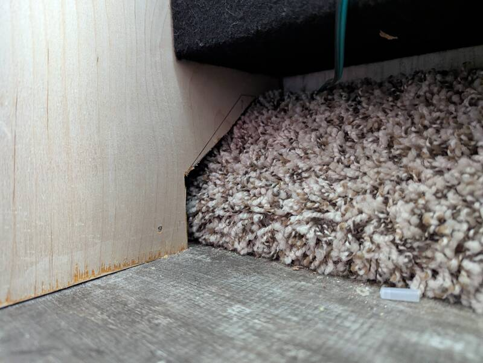

# Custom-Built Storage L-Bench

- Time: 2-3 days
- Money: 100$

## Goal

Create enough sitting space for six people around the table while maximizing
convenient storage options.

## Photos

  
  

  
  

  
  

  
  

## Materials

- 2"x2" Framing
- 2"x3" Hinge support
- 3/4" Plywood lids
- 1/8" Plywood siding (and bottoms if desired)
- [1-1/2" #8 Robertson Screws 500Pcs](https://www.amazon.com/Hillman-48256-2-Inch-Multipurpose-500-Pack/dp/B00KLM5LWO?tag=rvlifehacks-20)
  For the lid, not necessarily 500
- [2-1/2" #9 Robertson Screws 350Pcs](https://www.amazon.com/Hillman48274-Square-Drive-Multi-Purpose-Wood-Screws/dp/B00KLMWFIC?tag=rvlifehacks-20)
  For the 2x2s
- [6" 25lbs Gas struts](https://www.amazon.com/DerBlue-4-Pack-6inch-Struts-Cabinets/dp/B01N57HAFT?tag=rvlifehacks-20)
- [Piano Hinges](https://www.amazon.com/Stainless-Continuous-Thickness-Knuckle-Included/dp/B0BR155SHQ?tag=rvlifehacks-20)
- [2" Bench Cushions](https://www.amazon.com/ShadeMart-Furniture-High-Resilience-Waterproof-Anti-Slip/dp/B0DJ6K8G35?tag=rvlifehacks-20)
  Custom sized on order

## Dimensions

- 17-3/8" bottom to top (without the 2" cushion on top. Table top is at 30")
- 17-1/2" lid width
- Lid overhangs
  - side by 1/2" and
  - front by 1/4" (1/2" front-overhang would be better though) but make sure you
    can open both lids with the cushion on top without hitting the table

## Notes

I had built a previous one of these for another trailer. The current one doesn't
have sidewalls on the back and bottom but for frequent use I'd add them again to
avoid scratching the paint. It's a bit more materials and work though.

The bench is built in two separate and individually usable sections: The side
and the back. The side and the back are then screwed together before attaching
the siding so there is an opening between both storage sections.

Each section is built as a cuboid. The design works great but because of the
triangular rear-cutout for the carpet covered cable drive on this trailer, the
support across the rear wall is quite oddly shaped making the construction much
more intricate than if it went down straight.
