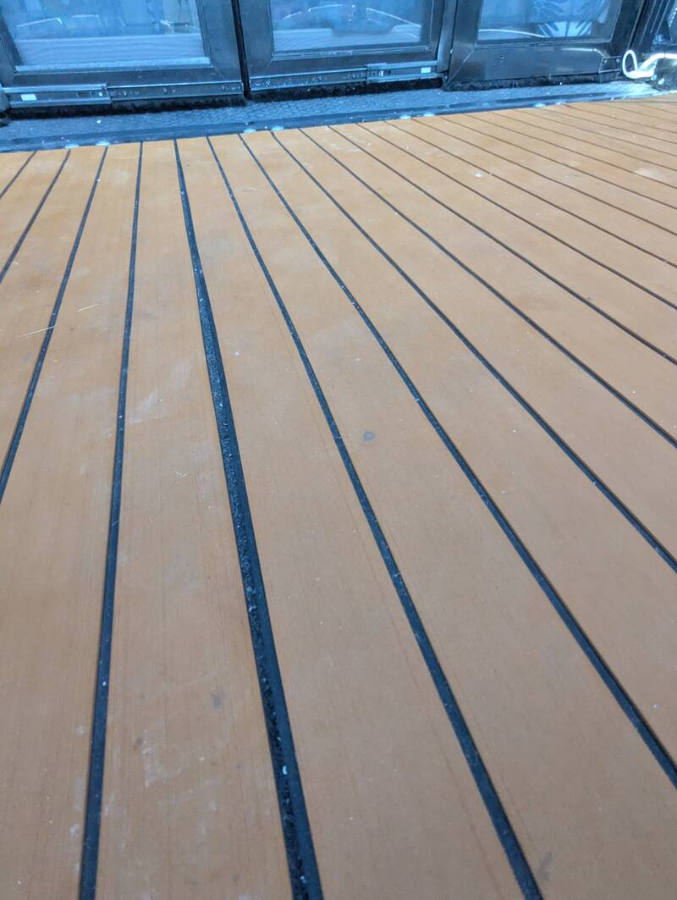
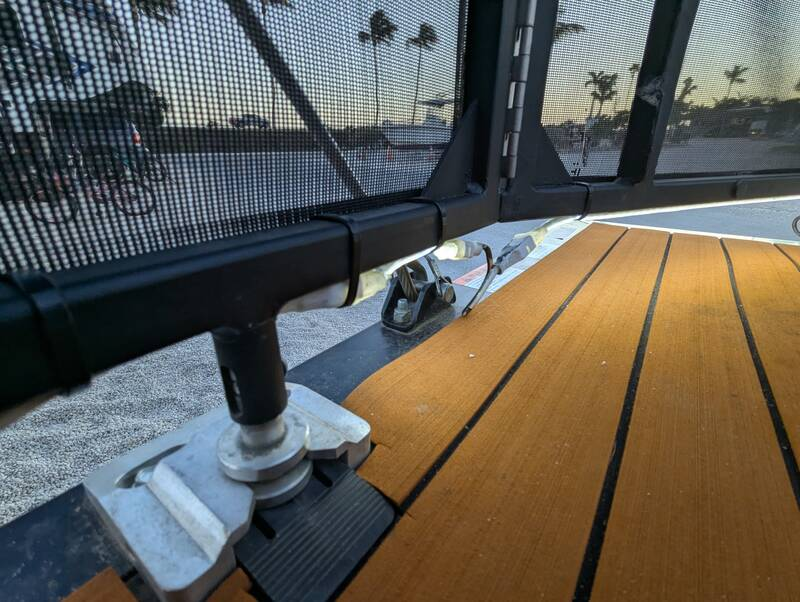

# Teak Deck on Ramp Door

- Time: A few hours effort
- Money: ~300$

## Goal
Non-slip, barefoot-friendly ramp surface that doesn't burn your feet when
exposed to the sun.

## Process
- Leave teak mat rolled out flat in the sun for a few days to let the material
  shrink to avoid gaps. Leaving it rolled out will also make it easier to
  stick-and-peel since it won't curl up as much.
- Clean the ramp and make sure it's dry
- Apply Primer with small paint roller
- Self-adhesive teak mat
- Seal the edges with black or clear silicone

## Photos

  
  

## Notes
- Shrinking process sets in fairly quickly but give it a few days. We skipped
  that step and now have ~1/16" gaps - not terrible but avoidable.
- Holds up well to rain and sun
- Easy to hose down

