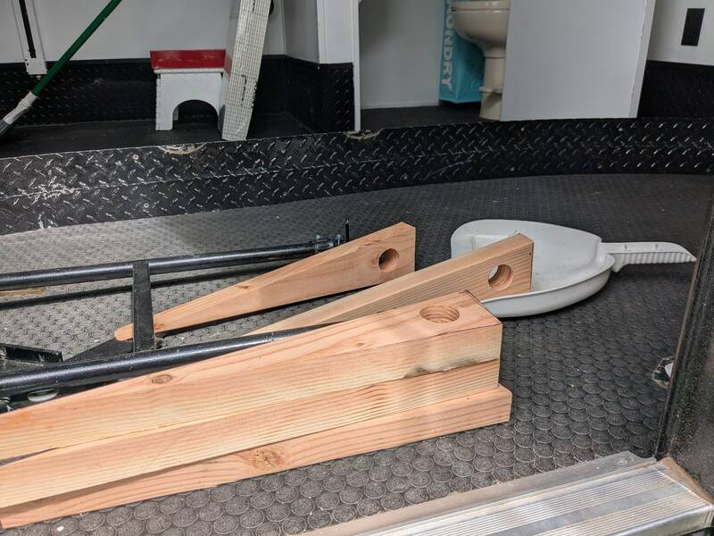
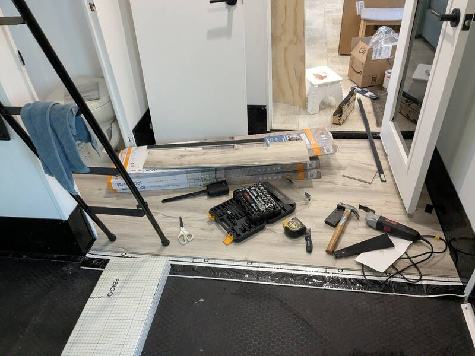
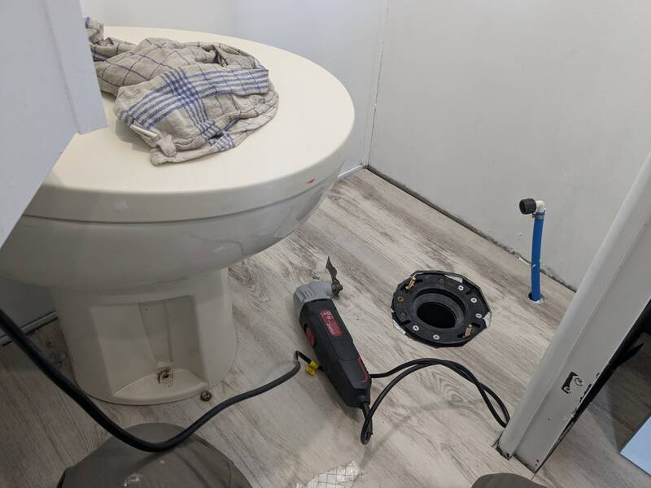
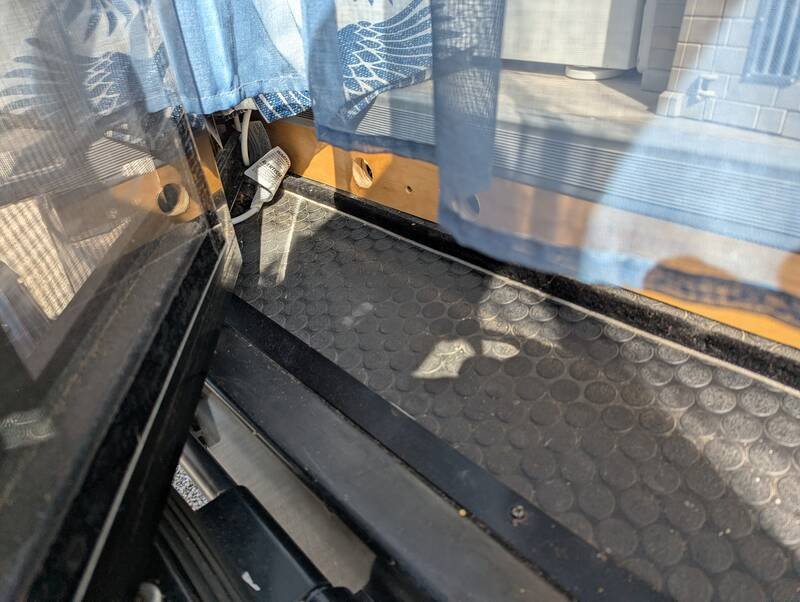

# Homey-Looking Luxury Vinyl Plank Garage Floor

[Back to Overview](../README.md)

- Time: 2 days
- Money: $400

## Goal

Flat homey looking floor instead of toy garage floor

## Photos

  
  

  
  

## Materials

- [Floor Underlayment](https://www.homedepot.com/p/Pergo-FloorMate-100-sq-ft-4-ft-x-25-ft-x-118-11-mm-T-Premium-Foam-Underlayment-for-Laminate-Engineered-Hardwood-PERFLRMTE/306749188)
- [Vinyl Planks](https://www.homedepot.com/p/Lifeproof-Chiffon-Lace-Oak-22-MIL-x-8-7-in-W-x-48-in-L-Click-Lock-Waterproof-Luxury-Vinyl-Plank-Flooring-20-1-sqft-case-I412211LP/311573442)
  Need 4
- [Edge Trim](https://www.amazon.com/Trimold-Anti-Slip-Adhesive-Staircase-Protector/dp/B0C98F7JW8?tag=rvlifehacks-20)
  over the new back step edge where the ramp was raised to straighten out the
  floor.

## Notes

- Remove all floor-hooks from the garage prior to laying the underlayment.
- Remove the toilet (it's just two bolts and you get to check the seal)
- Lay underlayment as you go with vinyl planks to prevent unnecessarily walking
  over it.
- Your knees will thank you if you use a
  [Kneeling Pad](https://www.homedepot.com/p/Husky-Kneeling-Pad-GD220568/321999865)
- Use about 6 2x4" beams to even out the rear ramp. Measure out the triangle for
  one, then use that one as adaptable template. It's a bit of process to get the
  top surface even. Lay a plywood board on top so you can feel if it moves when
  you walk on. If you can feel it move, you'll still feel it through the vinyl.
- Use the hole saw to drill a hole into the beams to have some air movement
  underneath and outwards.

  

- Treat the outward facing "stair step" beam with Polyurethane since shoes will
  eventually hit it.

- To store the bikes for transport, we first lay an
  [Extra Heavy Duty Tarp](https://www.homedepot.com/p/Everbilt-10-ft-x-12-ft-Gray-and-Black-Extra-Heavy-Duty-Tarp-KSEHD15DR1012/317652375)

[Back to Overview](../README.md)
